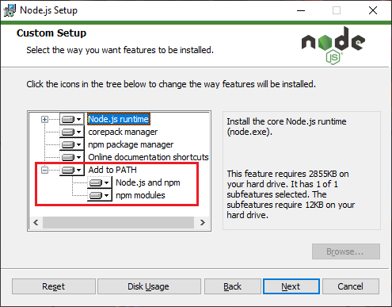

# Installer Node.js

À l'issue de ce module, vous serez capable de :

1. Installer la plateforme Node.js sur votre ordinateur
2. Vérifier le bon fonctionnement de votre configuration Node.js

---

## Présentation

Node.js est un environnement permettant l’exécution de JavaScript côté serveur.

Il est basé sur le [moteur d'exécution JavaScript V8](https://fr.wikipedia.org/wiki/V8_(moteur_JavaScript)). Ce moteur est utilisé dans les navigateurs web **Google Chrome**, **Microsoft Edge**, **Opera** et **Brave**

Écrit en C/C++, Node.js est connu pour être une plate-forme extrêmement performante grâce à sa capacité à pouvoir gérer la montée en charge, et gérer les entrées/sorties (I/O) de façon asynchrone grâce à la bibliothèque **libuv** spécialement conçue pour ça.

Dans ce cours, vous utiliserez Node.js comme **plateforme de développement**, pour lancer des commandes et installer des librairies JavaScript dans votre projet Firebase.

## Installer Node.js

Il existe plusieurs choix possibles pour installer Node.js sur sa machine.

1. **Facile et rapide :**
    Aller sur le [site officiel de Node.js](https://nodejs.org/fr/) et télécharger la dernière version (stable)

2. **Manuelle :**
    Utiliser le programme `nvm` (*Node Version Manager*) pour facilement pouvoir switcher entre les différentes versions de Node.js sur une même machine ([en savoir plus sur NVM](https://github.com/nvm-sh/nvm)).

Dans la plupart des cas, utiliser le premier choix est la meilleure option.

Si vous avez déjà installé Node.js auparavant, assurez-vous d'avoir une version récente.

Rendez-vous sur le site internet et télécharger la version la plus récente : **https://nodejs.org/fr/**

<p align="center"></p>

Vous choisirez généralement la version LTS (Long Term Support).

Laissez-vous ensuite guider par le programme d'installation, et assurez-vous si vous êtes sous Windows que vous avez bien l'option *« Add to PATH »* de présente :

<p align="center"></p>

Si le programme d'installation vous le propose, cochez également la case pour installer les outils de build supplémentaire :

<p align="center"></p>

Une fois l'installation terminée, fermez le programme. Et voilà ! Vous avez installé Node.js sur votre ordinateur !

## Vérifier l'installation de Node.js

Afin de vérifier que tout fonctionne correctement, ouvrez un terminal sur votre ordinateur.

> Il est recommandé sous Windows de ne plus utiliser l'invite de commande classique « cmd.exe » et d'utiliser **au minimum** le programme « Powershell », bien plus moderne et évolué.
> <p align="center"></p>

Tapez les commandes suivantes :

```bash
node --version
```

et 

```bash
npm --version
```

Dans les deux cas, vous devriez obtenir un numéro de version correspondant à celle que vous venez d'installer :

<p align="center"></p>

Si vous obtenez une erreur, essayez de fermer complètement votre terminal et de le rouvrir. Si le problème persiste, vous devrez peut-être redémarrer votre ordinateur pour que les variables d'environnement soient mises à jour.

---

# Vos points clés à retenir

- L'installation de Node.js se fait directement sur le site internet Nodejs.org
- Sous Windows, il est préférable de ne pas utiliser le terminal « cmd.exe »
- Les commandes `node --version` et `npm --version` permettent de confirmer que l'installation de Node.js est réussie.

# Conclusion

Maintenant que Node.js est installé sur votre ordinateur, vous pourrez travailler efficacement avec le SDK JavaScript de Firebase.

Mais il reste un autre logiciel à télécharger et configurer : il s'agit de **Visual Studio Code**.

Rendez-vous dans le prochain chapitre pour l'installer et le configurer ensemble.