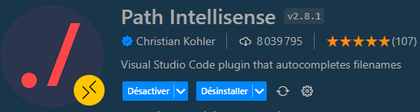
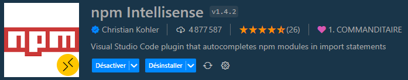

# Installer et configurer VSCode

À l'issue de ce module, vous serez capable de :

1. Installer l'éditeur Visual Studio Code sur votre ordinateur
2. Reconnaître et utiliser les bons plugins pour développer correctement avec Firebase

---

## Présentation

Visual Studio Code (abrégé « VSCode ») est un éditeur de code extensible développé par Microsoft pour Windows, Linux et macOS. Sorti en 2015, il devient rapidement populaire de par l'intégration native d'éléments pratiques pour le développement web, comme par exemple le terminal intégré et un gestionnaire de contrôle de version.

Aujourd'hui, Visual Studio Code est la solution numéro 1 pour développer **avec l'écosystème JavaScript**.

C'est l'éditeur tout indiqué pour travailler sur un projet Firebase.

## Installer VSCode

Rendez-vous sur le site web : https://code.visualstudio.com/ et cliquez sur le bouton de téléchargement. Laissez-vous guider par les étapes du programme d'installation, puis démarrez VSCode.

## Installer les extensions

Afin de pouvoir développer dans de bonnes conditions, vous utiliserez plusieurs extensions (plugins) de VSCode.

Les extensions s'installent en cliquant sur l'icône d'extensions dans la barre latérale de gauche :

Dans la barre de recherche, recherchez et installez les extensions suivantes :

1. **Live Server**

Cette extension permet de démarrer un serveur web local directement à partir de VSCode.

2. **Path Intellisense**

Cette extension permettra d'auto-compléter les noms de fichiers qu'elle trouvera dans votre arborescence.

3. **NPM Intellisense**

Cette extension permet de trouver et auto-compléter les librairies et fonctions installées via NPM.

4. **EditorConfig**

Cette extension offre la possibilité de configurer correctement les réglages de fichiers (indentations, encodage, fins de ligne, …) au sein d'un projet.

5. **Prettier**

Cette extension fournit la possibilité de reformater correctement le code HTML, CSS et JavaScript lors de la sauvegarde, via une configuration précise.

---

# Vos points clés à retenir

- VSCode est l'éditeur de choix pour les projets web Front-End en HTML, CSS et JavaScript
- VSCode peut être configuré et personnalisé grâce à des extensions

# Conclusion

Maintenant que votre éditeur de code est installé et correctement configuré, vous êtes prêts pour mettre en place votre premier projet Firebase.

Dans le prochain chapitre, vous allez découvrir comment créer la structure d'un projet Firebase avec le SDK JavaScript dédié.