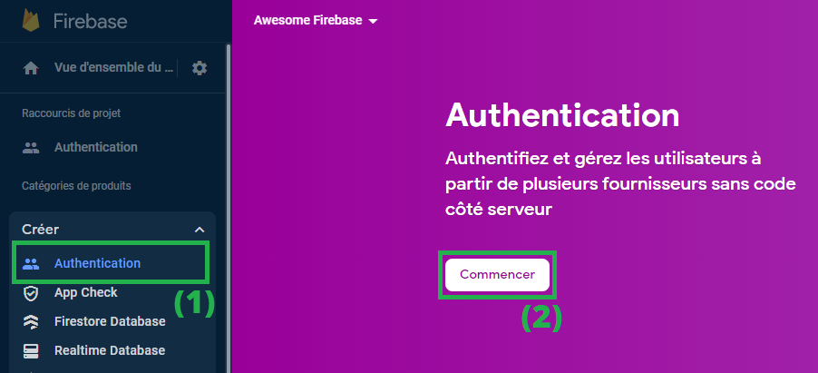
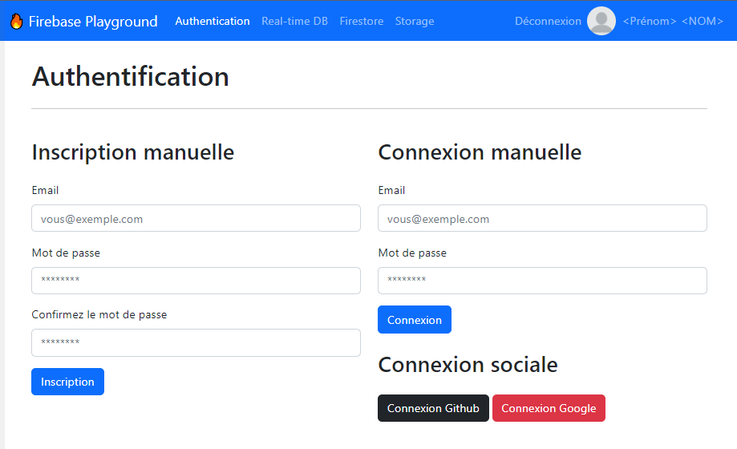
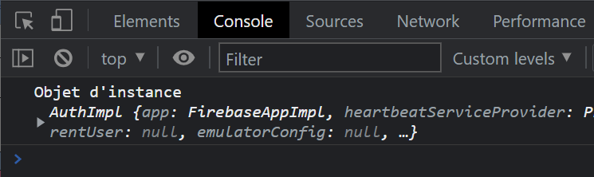

# Importer le service d'authentification dans la page web

À l'issue de ce module, vous serez capable de :

1. Activer l'authentification dans votre projet Firebase
2. Savoir importer le service d'authentification du SDK JavaScript dans une page web
3. Être capable de le configurer correctement

---

## Présentation

Aujourd'hui, authentifier ses utilisateurs de façon native et sécurisée requiert beaucoup d'éléments, à savoir :

- Avoir un système d'inscription/connexion
- Avoir un système de stockage des données utilisateurs comme une base de données SQL/NoSQL
- Sécuriser les données utilisateurs stockées (hachage de mot de passe)
- Sécuriser l'accès au compte en mettant en place une MFA (Multi-Factor Authentication)
- Gérer les comptes en double

De plus, si vous souhaitez offrir la possibilité à vos utilisateurs de s'authentifier grâce à leur compte Google, Facebook, Twitter ou Github (connexion sociale), il faut passer par les APIs de ces services et mettre en place la connexion avec le protocole OAuth, ce qui peut s'avérer fastidieux et chronophage.

**Firebase Authentication** répond à toutes ces problématiques en proposant un SDK simple d'utilisation pour le développeur, et une gestion des comptes utilisateurs via la Console Web Firebase (que nous découvrirons plus tard).

Il permet notamment d'inscrire des utilisateurs via les méthodes suivantes :

- E-mail et mot de passe
- Google Sign-In
- Facebook Login
- Twitter
- Github
- … d'autres "_providers_"


## Activer le service d'Authentification

Pour commencer, rendez-vous dans votre [Console Firebase](https://console.firebase.google.com/) sur votre projet "_Awesome Firebase_".

1. Dans le menu de gauche, déroulez le panneau **Créer** et cliquez sur **Authentication**
2. Dans la page de droite, cliquez sur le bouton **Commencer**

<p align="center"></p>

Cela va activer le service d'Authentification pour ce projet Firebase.

L'interface suivante va nous permettre par la suite d'activer des méthodes d'authentification et de gérer les utilisateurs inscrits à notre application.

Nous y reviendrons rapidement, mais d'abord il va falloir configurer également ce service dans notre projet « Firebase Playground »

## Exporter l'objet d'application pour les autres services

Dans le chapitre précédent, nous avons créé un fichier `public/scripts/index.js` pour initialiser le SDK JavaScript dans un nouvel objet `app`.

```js
// FICHIER : public/scripts/index.js
…
const app = initializeApp(firebaseConfig, 'Firebase Playground');
```

Cet objet `app` contient les informations d'initialisation de l'ensemble des services Firebase que nous utiliserons dans ce cours. Il est donc primordial d'y avoir accès depuis d'autres fichiers.

Afin de pouvoir facilement récupérer cet objet depuis d'autres fichiers de services, ajoutez le marqueur `export` devant la déclaration :

```js
…
export const app = initializeApp(firebaseConfig, 'Firebase Playground');
```

La constante `app` est maintenant _"importable"_ depuis d'autres fichiers.

> Cette opération ne sera a faire qu'une seule fois pour ce projet, mais elle est nécessaire car tous les futurs service de Firebase que nous utiliserons auront besoin de cet objet `app`

## Créer le fichier d'authentification

Dans le projet « Firebase Playground » se trouve une page `public/authentication.html`.

Ouvrez-la avec _Live Server_.

<p align="center"></p>

C'est sur cette page que vous allez travailler pour tout ce qui concerne la partie _Authentication_ dans ce cours.

Afin de rester organisé, il va falloir créer un fichier JavaScript à associer à cette page, en utilisant Webpack.

Pour rappel, la procédure est la suivante pour **tout nouveau fichier de bundle que l'on souhaite créer** :

1. Commencer par créer un nouveau fichier de script : `public/scripts/authentication.js`
2. Modifier la configuration de `webpack.config.js` pour ajouter une nouvelle entrée :
  ```js
  …
  entry : {
    index: './public/scripts/index.js',
    authentication: './public/scripts/authentication.js'
  }
  ```
3. Relancer la commande `npm run dev` dans le terminal
4. Inclure le fichier compilé `bundle/authentication.js` dans la page HTML :
  ```html
  <head>
    …
    <script src="bundle/authentication.js" defer></script>
  </head>
  ```

À partir de là, il est possible de travailler avec le SDK JavaScript de Firebase dans le fichier `public/scripts/authentication.js`.

## Importer le service d'authentification

Le SDK de l'authentification se trouve dans l'espace de nom `firebase/auth`.

Afin de pouvoir utiliser les fonctions d'authentification du SDK, il faut d'abord **créer une instance**.

Dans le fichier `authentication.js` précédemment créé, ajoutez les éléments suivants :

```js
// 1. Import de l'objet qui référence notre application Firebase pré-configurée
import { app } from './index';

// 2. Import de la fonction "getAuth' depuis le package "firebase/auth"
import { getAuth } from 'firebase/auth';

// 3. Création d'une "instance" du service d'authentification pour l'application "app"
const auth = getAuth(app);
```

Afin de vérifier qu'il n'y a aucun problème, n'hésitez pas à ajouter un message de log pour constater que l'objet d'instance est bien défini :

```js
…
console.log("Objet d'instance", auth);
```

<p align="center"></p>

---

# Pour aller plus loin

- Guide Firebase : [Get Started with Firebase Authentication on Websites](https://firebase.google.com/docs/auth/web/start?hl=en#add-initialize-sdk)
- Documentation : [getAuth()](https://firebase.google.com/docs/reference/js/auth.md?hl=en#getauth)

# Vos points clés à retenir

- Pour activer le service d'authentification, il faut se rendre dans la console Firebase
- Le SDK JavaScript pour l'authentification à besoin d'un objet `app` correctement configuré pour pouvoir créer une instance
- On créer une instance du service d'authentification avec la fonction `getAuth()`
- L'instance créée va permettre d'utiliser les fonctions du SKD JavaScript relatives à l'authentification

# Conclusion

Et voilà ! Le service d'authentification est activé pour votre projet Firebase, et votre fichier `authentication.js` dispose d'une instance qui va vous permettre de manipuler les fonctions d'authentification sur votre projet !

Prêt pour découvrir comment permettre à vos utilisateurs de s'authentifier avec un _email_ et un _mot de passe_ ?

C'est ce que vous aller découvrir dans le prochain chapitre !
