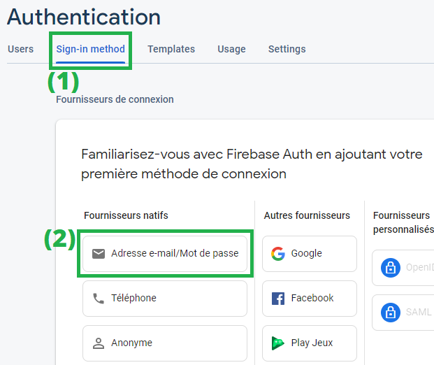
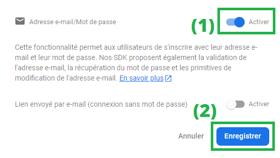

# S'authentifier avec une adresse email et un mot de passe

À l'issue de ce module, vous serez capable de :

1. Activer une nouvelle méthode d'authentification via la console Firebase
2. Utiliser le SDK Firebase pour inscrire un nouvel utilisateur
3. Utiliser le SDK Firebase pour connecter un utilisateur inscrit

---

## Présentation

Le service d'Authentification de Firebase propose différentes **méthodes** d'authentification. Celle que nous allons voir dans ce chapitre est la méthode via **email et mot de passe**.

## Activer la méthode d'authentification par email

Rendez-vous dans votre console Firebase, dans la section "_Authentication_" du panneau de gauche, puis effectuez la procédure suivante (cf. figure 1):

1. Cliquez sur l'onglet « _Sign-in method_ »
2. Choisissez le fournisseur « _Adresse e-mail/Mot de passe_ »

> **Figure 1**
> <p align="center"></p>


Dans la fenêtre qui s'ouvre ensuite (cf. figure 2):

1. Activez le service
2. Cliquez sur le bouton « _Enregistrer_ »

> **Figure 2**
> <p align="center"></p>

La méthode d'authentification par email et mot de passe est maintenant prête !

Nous allons pouvoir désormais utiliser le SDK JavaScript dans notre projet pour inscrire un nouvel utilisateur.

## Inscrire un nouvel utilisateur

Le package `firebase/auth` fournit la fonction JavaScript [createUserWithEmailAndPassword()](https://firebase.google.com/docs/reference/js/auth.md?hl=en#createuserwithemailandpassword) dont la signature est  :

```js
function createUserWithEmailAndPassword(
  auth: Auth,
  email: string,
  password: string
): Promise<UserCredential>;
```

Cette fonction **prend 3 arguments** et **renvoie une promesse** dont la valeur sera un objet de type [UserCredentials](https://firebase.google.com/docs/reference/js/auth.usercredential.md#usercredential_interface).

Voici un exemple d'utilisation :

```js
import { app } from './index';
import { getAuth, createUserWithEmailAndPassword } from 'firebase/auth';

// Récupère l'instance du service Authentication
const auth = getAuth(app);

async function inscription() {
  const email = 'john.doe@example.com';
  const password = 'p4$$w0rd';

  // Crée un nouvel utilisateur
  const credentials = await createUserWithEmailAndPassword(auth, email, password);

  // L'objet représentant l'utilisateur inscrit est renvoyé dans `credentials.user`
  const user = credentials.user;

  // L'objet `user` contient plein d'informations sur le nouvel utilisateur
  console.log(`Utilisateur ${user.email} enregistré !`);
}

inscription(); // Lancement de la fonction …
```

En exécutant ce code, cela va créer le nouvel utilisateur dont l'identifiant est `john.doe@example.com` et le mot de passe `p4$$w0rd`.

> On peut s'en rendre compte dans la console Firebase en allant voir dans l'onglet « _Users_ » (1), on constate que l'utilisateur « john.doe@example.com » a bien été créé (2)
> 
> <p align="center"></p>

Nous voyons bien qu'avec Firebase, gérer l'inscription d'un nouvel utilisateur est d'une simplicité étonnante.

De plus, Firebase s'occupe de gérer les cas particuliers et de renvoyer des erreurs dans les cas suivants :

- Si les champs sont vides
- Si le format de l'adresse e-mail est invalide
- Si le mot de passe choisi est considéré comme faible (ex: inférieur à 6 caractères)
- Si l'adresse e-mail choisie est déjà inscrite sur cette application Firebase

Mis-à-part gérer ces erreurs que le SDK Firebase pourrait nous renvoyer, nous n'avons rien à faire côté front-end en ce qui concerne la logique de traitement (sauf peut-être pour améliorer l'expérience utilisateur en évitant des appels réseau inutiles)

Traiter les erreurs est donc primordial. Voyons cela.

En JavaScript moderne lorsqu'on utilise `async/await`, on traite les erreurs avec un bloc `try/catch` :

```js
…
async function inscription() {
  const email = 'john.doe@example.com';
  const password = 'p4$$w0rd';

  try {
    const credentials = await createUserWithEmailAndPassword(auth, email, password);

    const user = credentials.user;

    console.log(`Utilisateur ${user.email} enregistré !`);
  }
  catch (error) {
    console.error("Une erreur s'est produite lors de l'inscription :", error.message);
  }
}
```

Si tout se passe correctement, l'ensemble des instructions du bloc `try` vont s'exécuter sans problèmes, et si une erreur survient, on la gère directement dans le bloc `catch`

> **Note** :
> Dans un véritable cas de figure, au lieu de faire un `console.log`, nous afficherions plutôt les messages d'erreur et de succès dans une `<div>` de la page web pour informer l'utilisateur :
> <p align="center"></p>
> <p align="center"></p>

## Connecter un utilisateur inscrit

Connecter un utilisateur via son email et mot de passe (que lui seul connaît 🙂) est tout aussi simple avec le SDK Firebase.

De la même manière que pour l'inscription, le package `firebase/auth` fournit la fonction  [signInWithEmailAndPassword()](https://firebase.google.com/docs/reference/js/auth.md?hl=en#signinwithemailandpassword) dont voici la signature :

```js
function signInWithEmailAndPassword(
  auth: Auth,
  email: string,
  password: string
): Promise<UserCredential>;
```

On l'utilise de la même manière pour authentifier un utilisateur :

```js
async function connexion() {
  const email = 'john.doe@example.com';
  const password = 'p4$$w0rd';

  try {
    const credentials = await signInWithEmailAndPassword(auth, email, password);

    const user = credentials.user;

    console.log(`Utilisateur ${user.email} connecté !`);
  }
  catch (error) {
    console.error("Une erreur s'est produite lors de l'inscription :", error.message);
  }
}
```

Firebase va comparer les informations stockées avec les identifiants envoyés et retourner un objet de type [UserCredentials](https://firebase.google.com/docs/reference/js/auth.usercredential.md#usercredential_interface) en cas de succès, ou une erreur en cas de problème.

Les cas d'erreur les plus courants sont (de manière non exhaustive) :

- Adresse email pas encore inscrite
- Mot de passe invalide

> **Note** :
> Il est évident que Firebase ne stocke pas en clair les mots de passe et utilise des algorithmes de hachage que lui-seul connaît. De cette façon, les identifiants de nos utilisateurs sont en sécurité.
> Cette abstraction est gérée par Firebase lui-même, et nous n'avons pas à nous en soucier de notre côté.

## `UserCredentials` et `User`

Nous avons vu que dans les 2 cas, si l'opération se passe correctement, un objet de type [UserCredentials](https://firebase.google.com/docs/reference/js/auth.usercredential.md#usercredential_interface) nous est retourné.

D'après la documentation, cet objet dispose des propriétés suivantes :

- **`operationType` : Type de la méthode choisie pour s'authentifier**
  Vous avez peut-être constaté qu'il était aussi possible d'authentifier vos utilisateur sans mot de passe en leur proposant de générer un lien de connexion unique

- **`providerId` : Provider utilisé pour la connexion**
  Nous verrons cela dans un prochain chapitre, mais sachez pour l'instant qu'un "provider" correspond à un type d'authentification sociale (Google, Twitter, Facebook Connect …)

- **`user` : Un objet qui représente les données disponibles de l'utilisateur**

Ce dernier élément `user` est de type [User](https://firebase.google.com/docs/reference/js/auth.user.md?hl=en#user_interface) et étend le type [UserInfo](https://firebase.google.com/docs/reference/js/auth.userinfo.md?hl=en#userinfo_interface).

Les propriétés suivantes (liste non exhaustive) sont donc accessibles sur cet objet :

- `uid` : Identifiant unique associé à l'utilisateur par Firebase
- `displayName` : Nom d'affichage de l'utilisateur
- `email` : Adresse email de l'utilisateur
- `photoURL` : L'URL de la photo de profil de l'utilisateur
- `providerId` : Nom du provider utilisé par l'utilisateur pour s'authentifier (si applicable)

> **Warning** :
> Il est important de noter que ces propriétés sont présentes **de façon normalisée** pour nous permettre en tant que développeur de les traiter facilement.
> Ex: Un utilisateur qui se connecte via login et mot de passe n'aura pas de `displayName` associé, ce qui pourra en revanche être le cas d'un utilisateur authentifié via "Facebook Connect" (sauf s'il ne le permet pas dans ses paramètres de sécurité). C'est pareil pour son adresse email …
> Ne vous étonnez donc pas si ces valeurs sont vides pour certains utilisateurs et non pour d'autres.
> **Souvenez-vous que vous n'aurez accès qu'aux informations pour lesquelles vos utilisateurs ont donné leur consentement.**

---

# Pour aller plus loin

- [Authenticate with Firebase using Password-Based Accounts using Javascript](https://firebase.google.com/docs/auth/web/password-auth?hl=en)

# Vos points clés à retenir

- Pour inscrire un nouvel utilisateur, on utilise la méthode `createUserWithEmailAndPassword` du package `firebase/auth`
- Pour connecter un utilisateur déjà inscrit, on utilise la méthode `signInWithEmailAndPassword` du package `firebase/auth`
- L'objet obtenu en retour d'une inscription/connexion est de type `UserCredentials` et contient un sous-objet `User` représentant l'utilisateur authentifié.

# Conclusion

Maintenant que vous savez comment connecter et inscrire des utilisateurs de façon classique, nous allons découvrir comment le faire avec une autre méthode : via un **compte Google**.

Rendez-vous dans le prochain chapitre pour cela !

