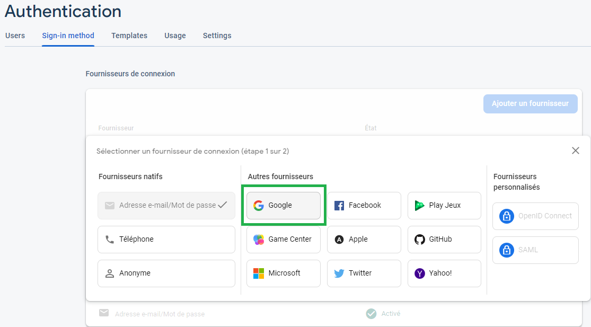
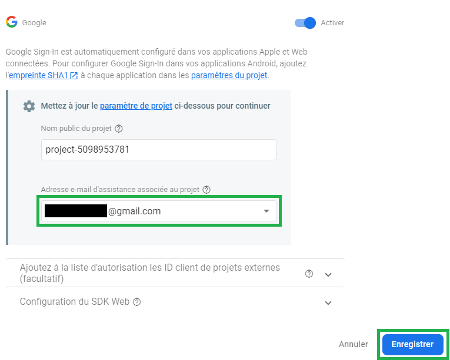
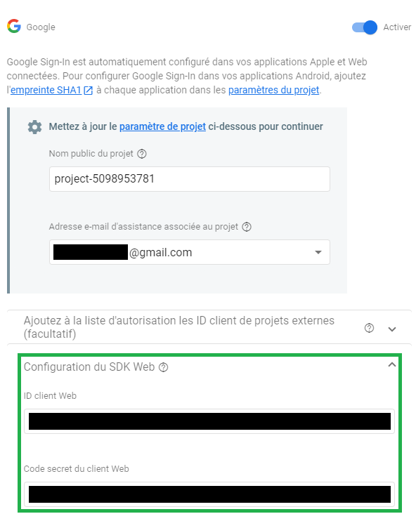

# S'authentifier avec un compte Google

À l'issue de ce module, vous serez capable de :

1. Identifier le terme « Provider »
2. Créer et relier une application Google à votre application Firebase
3. Utiliser le SDK Firebase pour connecter un utilisateur via son compte Google

---

## Présentation

Proposer un système d'inscription et connexion à ses utilisateurs avec un login et mot de passe est une bonne chose. Mais parfois certains visiteurs peuvent être réticents à créer un nouveau compte pour un énième service. L'option de passer via un service qu'ils connsaiisent déjà peut alors être une solution intéressante.
On appelle cela passer par un **fournisseur** (ou **« provider »** en Anglais).

Un fournisseur se réfère à une entité qui fournit un service d'authentification. C'est le cas par exemple de :

- Google (Google Sign-In)
- Facebook (Facebook Connect)
- Twitter (Sign in with Twitter)
- Github (Github OAuth)
- OpenID (OpenID Connect)
- …

Dans ce chapitre, nous allons voir d'abord comment proposer à nos utilisateurs la connexion via leur compte Google avec « Google Sign-In »

## Ajouter le fournisseur Google

Dans un premier temps, rendez-vous dans votre console Firebase, dans la section "Authentication" du panneau de gauche, puis cliquez à nouveau sur l'onglet _« Sign-in method »_

Cliquez sur le bouton _« Ajouter un fournisseur »_ et choisissez _« Google »_

<p align="center"></p>

Dans la popup qui s'ouvre, cliquez sur le bouton _« Activer »_

Le nom public du projet est automatiquement rempli avec le nom de votre projet Firebase.

Renseignez simplement une adresse e-mail d'assistance associé au projet, et cliquez sur _« Enregistrer »_

<p align="center"></p>

> ℹ️ **À noter** :
> En réalité sous cette opération, Firebase a créé et configuré de façon automatique une nouvelle **application Google** à votre nom de compte.
> Cette application Google a été associée automatiquement à votre application Firebase via un **client ID** et un **code secret**.
> Si vous retourner sur le provider Google, vous observerez que ces éléments sont déjà renseignés dans la section _« Configuration du SDK Web »_ :
> 
> <p align="center"></p>
>
> S'agissant de produits Google, l'opération a pu être réalisée automatiquement pour nous faciliter la tâche, cependant lorsque nous voudrons utiliser un autre provider (comme Github), nous devrons réaliser cette étape nous-même en créant une **application Github**.
> Nous aborderons cela dans le chapitre suivant, dédié à la connexion Github.

Et voilà ! Nous avons configuré un nouveau provider d'authentification pour notre application Firebase.

Il est maintenant temps de passer à la partie JavaScript dans notre projet web.

## S'authentifier dans la page web avec Google

Il est possible de lancer une authentification Google avec Firebase grâce à la méthode [signInWithPopup()](https://firebase.google.com/docs/reference/js/auth.md?hl=en#signinwithpopup) du SDK JavaScript, dont la signature est  :

```js
function signInWithPopup(
  auth: Auth,
  provider: AuthProvider,
  resolver?: PopupRedirectResolver
): Promise<UserCredential>;
```

Comme son nom l'indique, cette fonction permet de déclencher le processus d'authentification via Google en passant par une popup de connexion.

> 💡 **Note :**
> Si vous n'aimez pas les popups, sachez qu'il est possible de faire la même action via une **redirection** grâce à une autre fonction nommée [signInWithRedirect()](https://firebase.google.com/docs/reference/js/auth.md?hl=en#signinwithredirect)

De la même façon que dans le chapitre précédent, cette fonction **renvoie une promesse** dont la valeur sera un objet de type [UserCredentials](https://firebase.google.com/docs/reference/js/auth.usercredential.md#usercredential_interface) si l'utilisateur a validé la popup de connexion.

Voici un exemple d'utilisation :

```js
import { app } from "./index";
import { getAuth, GoogleAuthProvider, signInWithPopup } from "firebase/auth";

const auth = getAuth(app);

// Connexion via popup :
const provider = new GoogleAuthProvider();
const credentials = await signInWithPopup(auth, provider);

// L'objet représentant l'utilisateur inscrit est renvoyé dans `credentials.user`
const user = credentials.user;

console.log(`Utilisateur connecté via Google !`, user);
```

> 💡 **Note :**
> Pour des raisons de simplicité, le code ci-dessus a été simplifié, mais il est évident qu'il faut toujours penser à gérer les potentielles erreurs avec un bloc `try/catch`, et n'activer une action d'authentification que lors d'une interaction utilisateur, par exemple après un clic sur un bouton.

#### Explications du code

Dans le code précédent, on commence par créer une instance de l'objet `GoogleAuthProvider` qui permet de représenter le provider "Google".

On passe ensuite cette instance de provider (ainsi que l'instance d'authentification) à la méthode `signInWithPopup` va déclencher l'ouverture d'une popup dans laquelle l'utilisateur pourra se connecter de façon sécurisée avec ses identifiants Google.

Durant ce processus, la promesse renvoyée par la méthode reste en attente de la popup. Si cette dernière se referme avec une authentification réussie, alors la promesse est résolue et on récupère bien l'objet de type **UserCredentials** comme dans le chapitre précédent. Sinon, la promesse est rejetée et l'erreur doit être gérée dans un bloc `catch`.

---

# Pour aller plus loin

- [Authenticate Using Google with JavaScript](https://firebase.google.com/docs/auth/web/google-signin?hl=en)

# Vos points clés à retenir

- Pour ajouter la méthode d'authentification via Google, il suffit d'ajouter le fournisseur **Google** via l'interface de la console.
- L'ajout de cette méthode d'authentification nécessite la création d'une **application Google** (laquelle est automatiquement créée pour ce fournisseur).
- Le SDK JavaScript propose une méthode `signInWithPopup` qui va déléguer la connexion au fournisseur associé et donner un retour en cas de succès ou d'erreur.

# Conclusion

Félicitations ! Vous savez maintenant configurer une nouvelle méthode d'authentification via un provider externe. Ne nous arrêtons pas en si bon chemin et voyons comment faire la même chose avec le provider **Github**, en passant dans le chapitre suivant.