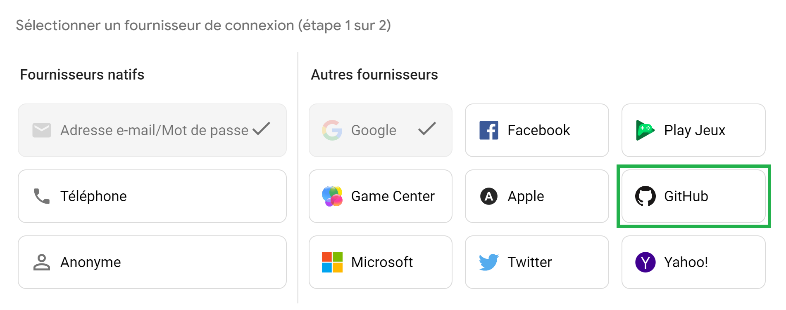
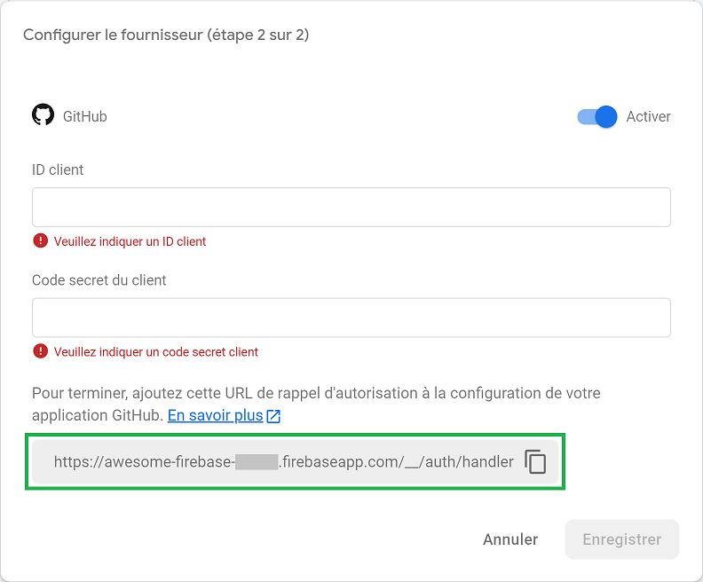
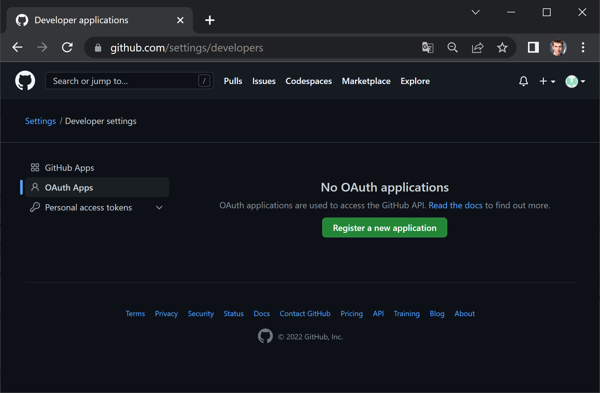
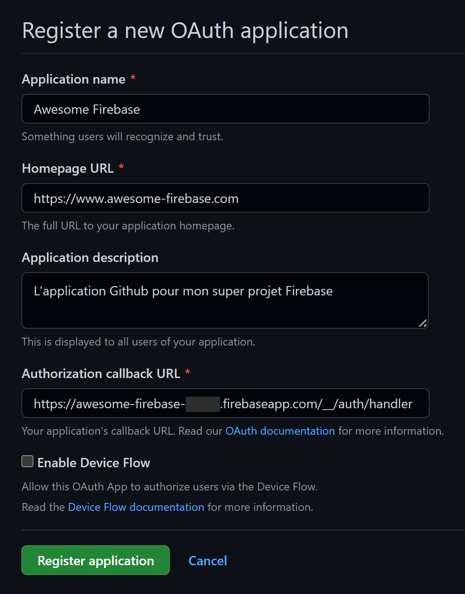
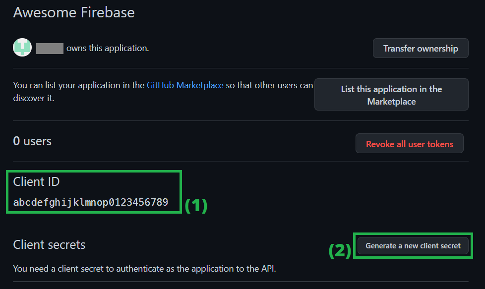
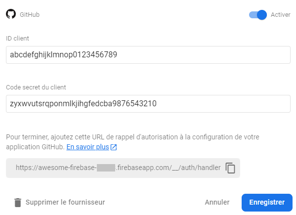
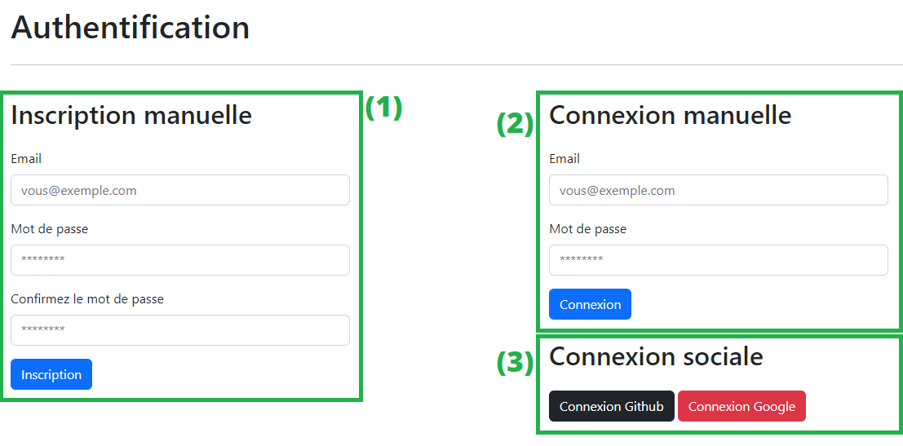
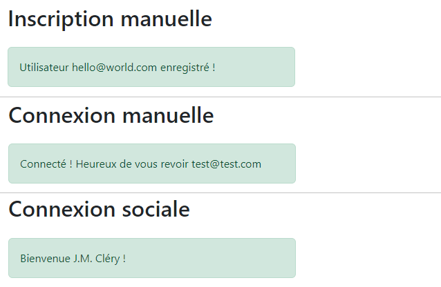

# S'authentifier avec un compte Github

À l'issue de ce module, vous serez capable de :

1. Créer et configurer correctement une nouvelle application développeur Github
2. Ajouter le provider "Github" à votre application Firebase en y reliant votre application Github 
3. Utiliser le SDK Firebase pour connecter un utilisateur via son compte Github

---

## Présentation

Il peut être intéressant de proposer à ses utilisateurs plusieurs fournisseurs en lesquels il peut avoir confiance pour se connecter à votre application web.

Le dernier fournisseur ajouté était "Google", ce qui nous facilitait la tâche en nous évitant de devoir créer manuellement une **application Google** pour la lier à notre application Firebase.

En revanche pour des fournisseurs tiers, nous allons devoir créer nous-même une application développeur directement chez le fournisseur en question.

Dans ce chapitre, nous allons faire la procédure ensemble pour le nouveau fournisseur **Github**.

## Ajouter le fournisseur Github

Pour commencer, retournez dans votre console Firebase et ajouter un nouveau provider comme vous l'aviez fait pour Google. Choisissez _« Github »_ dans _« Autres fournisseurs »_ 

<p align="center"></p>

Dans la popup qui s'ouvre, cliquez sur le bouton _« Activer »_

<p align="center"></p>

Notez que Firebase nous demande ici 2 éléments :

- Un ID client
- Un code secret client

Ces identifiants correspondront à l'application Github que nous allons créer.

Notez également la valeur de l'URL de rappel d'autorisation (en vert sur le schéma) qui sera utile pour la création de l'application Github. Il est conseillé de la garder de côté.

Nous allons maintenant créer une application Github. Pour cela, ouvrez un nouvel onglet de navigation web et rendez-vous à l'adresse suivante : https://github.com/settings/developers (si vous n'avez pas encore de compte Github, il va falloir en créer un pour pouvoir continuer).

<p align="center"></p>

> 💡 **Note :**
>
> Cette page est accessible depuis le menu `Settings >> Developer settings >> OAuth apps`

Cliquez sur le bouton « Register a new application »

Dans le formulaire qui s'affiche renseignez les champs demandés :

- **Application name** : Le nom de votre application Github.
  Généralement, vous mettrez le même nom que votre application Firebase pour ne pas désorienter vos utilisateurs.
- **Homepage URL** : Il s'agit du lien vers le site web qui héberge votre application
  Mettre un lien non valide n'est pas un problème pendant le développement, mais il faudra en choisir un valide lorsque votre site web ira en production.
- **Application description** : Description de votre application Github.
  Elle sera visible par toute personne qui voudra s'authentifier via Github.
- **Authorization callback URL** : URL de rappel d'autorisation fournie par Firebase.
  C'est à URL que Github devra rediriger après une tentative de connexion.

<p align="center"></p>

Laissez les autres champs par défaut et validez en cliquant sur « Register application »

À la suite de cette opération, vous allez arriver sur un nouvel écran :

<p align="center"></p>

1. Votre identifiant client pour cette application, qu'il faudra copier vers le champs "ID client" de la popup Firebase.
2. Cliquez-ici pour générer un "secret token", qu'il faudra ensuite également copier vers le champs "Code secret du client" de la popup Firebase.

<p align="center"></p>

Une fois ces informations renseignées dans la configuration du provider Firebase, vous pouvez enregistrer et fermer.

Et voilà ! Nous avons configuré un nouveau provider d'authentification pour notre application Firebase.

Terminons maintenant avec la partie JavaScript dans notre projet web.

## S'authentifier dans la page web avec Github

La méthode est en tout point similaire avec celle de l'authentification via Google, sauf que l'on va devoir instancier un `GithubAuthProvider` à la place :

```js
import { getAuth, GithubAuthProvider, signInWithPopup } from "firebase/auth";

// …

const provider = new GithubAuthProvider();
const credentials = await signInWithPopup(auth, provider);

// …
```

## Challenge : Mettre en place l'authentification dans le projet

Dans le projet « Firebase Playground » livré avec ce cours, il y a une page HTML dédiée à l'authentification qui regroupe 3 fonctionnalités souhaitées :

<p align="center"></p>

1. Fonctionnalité 1 : L'inscription d'un utilisateur via un email et mot de passe
2. Fonctionnalité 2 : L'authentification d'un utilisateur via son email et mot de passe
3. Fonctionnalité 3 : L'authentification d'un utilisateur via les fournisseurs « Github » et « Google »

Vous allez dans la dernière partie de ce chapitre devoir mettre en place ces fonctionnalités.

Vous travaillerez principalement dans le fichier `./public/scripts/authentication.js` et utiliserez les fonctions du SDK JavaScript vues dans les chapitres précédents.

Vous devrez afficher un message dans la page informant de chaque tentative réussie d'inscription et d'authentification :

<p align="center"></p>

Vous penserez également à gérer les erreurs potentielles retournées par Firebase dans la page web.

**Bonus :**
> Lors d'une connexion réussie (quelle qu'elle soit), mettez également en place une fonction faisant la mise à jour du DOM pour le header de la page avec les informations de l'utilisateur :
> <p align="center"></p>
> (Dans le cas par défaut où l'utilisateur n'est pas authentifié, ne rien afficher)

#### Conseils :

N'hésitez pas à ajouter des classes CSS ou identifiants dans le HTML si vous en ressentez le besoin pour manipuler les éléments du DOM.

Si vous avez l'impression d'écrire du code redondant, n'hésitez pas à vous fabriquer des fonctions JS réutilisables (par exemple pour gérer l'affichage des erreurs sous forme d'alertes) et à les placer dans un fichier module `.js` distinct que vous pourrez **importer** dans votre fichier principal.

Bon courage ! 🙂

---

# Pour aller plus loin

- [Authenticate Using Github with JavaScript](https://firebase.google.com/docs/auth/web/github-auth?hl=en)

# Vos points clés à retenir

- Pour ajouter la méthode d'authentification via Github, il faut ajouter le fournisseur **Github** via l'interface de la console.
- Cela nécessite la création d'une application Github OAuth directement sur le site : github.com
- Une fois l'application Github créée, il faut fournir les identifiants public et secret à Firebase pour terminer la configuration du provider.

# Conclusion

Bravo ! Vous en savez assez maintenant pour configurer n'importe quel provider externe supporté par Firebase.
Il ne faut que créer une application tierce et récupérer les identifiants public et secret fournis, et le tour est joué.

Maintenant que vous savez authentifier vos utilisateurs de toutes les façons possibles, voyons comment gérer un autre problème : la persistence de la session lors du rafraîchissement de la page.

Rendez-vous dans le prochain chapitre pour cela 🙂