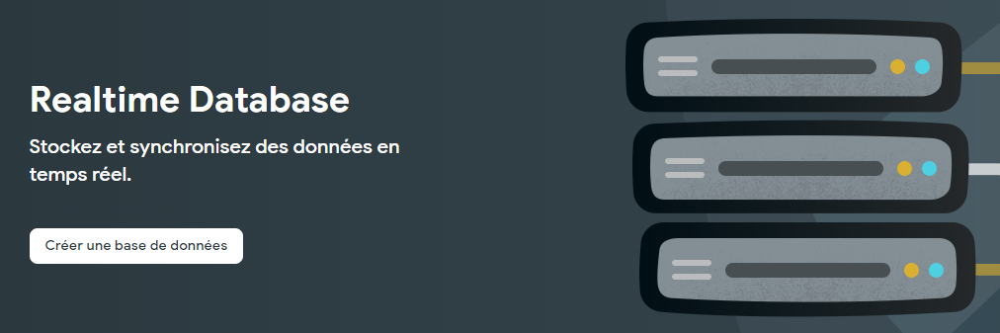
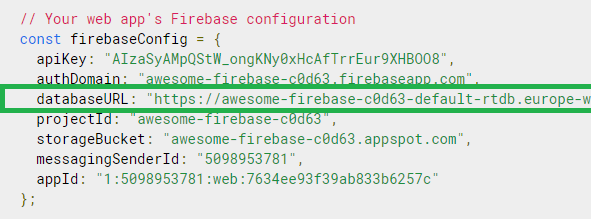
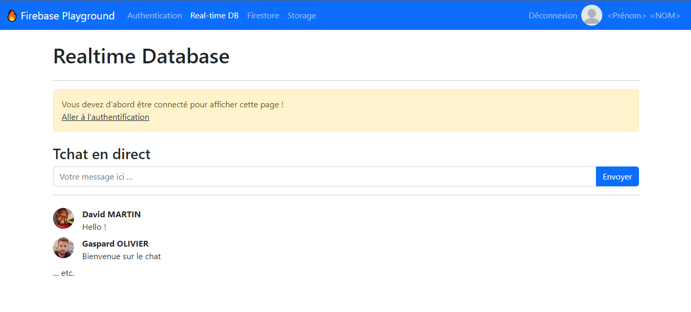

# Importer le service de Database dans la page web

À l'issue de ce module, vous serez capable de :

1. Définir ce qu'est une base de données en temps réel F irebase
2. Activer le service Realtime Database dans la console
3. Importer le service « _database_ » du SDK JavaScript dans une page web

---

## Présentation

Realtime Database (ou Realtime DB) est un service de Firebase proposant de stocker des données simples et en temps réel sur le cloud.

La synchronisation en temps réel se fait en moins de 500 milli-secondes, et est adaptée pour les applications à faible latence (jeux vidéo, chats). Elle permet notamment jusqu'à 100 connexions simultanées (sur le plan Gratuit).

Le SDK JavaScript gère de façon transparente les données en mode hors-ligne. Cela veut dire que si un client perd sa connexion réseau, l'application web continuera à fonctionner correctement (dans la mesure du possible).

## Activez votre première base de données

Afin d'utiliser ce service, il faut d'ores-et-déjà l'activer dans la console Firebase.

Rendez-vous dans le menu de gauche `Créer >> Realtime Database`, puis cliquez sur le bouton « **Créer une base de données** »

<p align="center"></p>

La création se fait en 2 étapes :

1. Choisissez la zone _Europe_ la plus proche
2. Définissez les règles de sécurité sur **le mode test**
(_Ce mode va permettre d'ouvrir la base en accès lecture et écriture pour faire des tests. Nous étudierons plus tard les règles de sécurité_)

Et voilà ! Votre base de données en temps réel est créée et prête à l'emploi.

## Récupérer la configuration

L'activation d'une Realtime DB donne une adresse web vers cette base de données. Elle est nécessaire pour le bon fonctionnement du SDK JavaScript, il faut donc mettre à jour la configuration du SDK JavaScript.

En retournant dans les paramètres du projet, une nouvelle ligne `databaseURL` est apparue dans la configuration.

<p align="center"></p>

Il faut mettre à jour cette nouvelle configuration dans le fichier `public/scripts/config.js` du projet JavaScript.

## Créer le fichier pour la base de données

Dans le projet « Firebase Playground » se trouve une page `public/realtime-db.html`.

Ouvrez-la avec _Live Server_.

<p align="center"></p>

C'est sur cette page que vous allez travailler pour tout ce qui concerne la partie _Realtime Database_ dans ce cours.

Afin de rester organisé, il va falloir une nouvelle fois créer un fichier JavaScript à associer à cette page, en utilisant Webpack.

Créez un nouveau fichier de script : `public/scripts/realtime-db.js`

Modifiez ensuite la configuration de `webpack.config.js` pour ajouter une nouvelle entrée :

```js
…
entry : {
  index: './public/scripts/index.js',
  authentication: './public/scripts/authentication.js',
  'realtime-db': './public/scripts/realtime-db.js',
}
```

N'oubliez pas d'inclure le fichier compilé `bundle/realtime-db.js` dans la page HTML :

```html
<head>
  …
  <script src="bundle/realtime-db.js" defer></script>
</head>
```

Enfin, relancez la commande `npm run dev` dans le terminal.

Vous pouvez commencer à travailler.

## Importer le service _Database_

Le fonctionnement de ce service repose sur le même principe que l'authentification. Il faut créer une **instance** :

```js
// 1. Import de l'objet qui référence notre application Firebase pré-configurée
import { app } from './index';

// 2. Import de la fonction "getDatabase' depuis le package "firebase/database"
import { getDatabase } from 'firebase/database';

// 3. Création d'une "instance" du service Database pour l'application "app"
const db = getDatabase(app);
```

Ajoutez cela dans le fichier `realtime-db.js`

---

# Pour aller plus loin

- [Installation & Setup in JavaScript](https://firebase.google.com/docs/database/web/start?hl=en)
- Documentation : [getDatabase()](https://firebase.google.com/docs/reference/js/database?hl=en#getdatabase)

# Vos points clés à retenir

- Une Realtime Database permet de stocker et manipuler des données en temps réel.
- Pour activer le service Realtime Database, il faut se rendre dans la console Firebase
- On créer une instance du service de base de données avec la fonction `getDatabase()`
- L'instance créée va permettre d'utiliser les fonctions du SKD JavaScript relatives à la base de donnée en temps réel

# Conclusion

Et voilà ! Vous avez créé votre première base de données en temps réel.

Avant de commencer à coder, nous allons étudier la façon dont sont stockées les données dans ce type de base en regardant sa structure.

À tout de suite dans le prochain chapitre !
