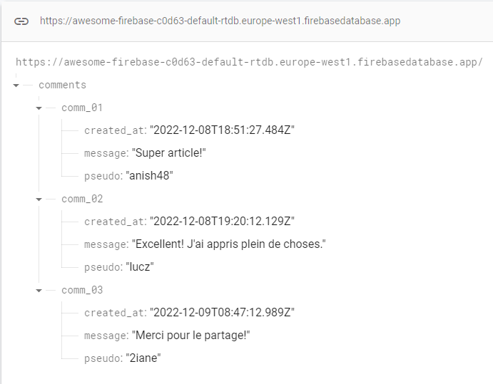

# Récupérer la référence d'un noeud

À l'issue de ce module, vous serez capable de :

1. Savoir ce qu'est une référence
2. Savoir comment manipuler une référence

---

## Présentation

La référence d'un noeud correspond à son chemin d'accès dans la Realtime DB.

On peut l'imaginer comme une URL : `/chemin/vers/noeud`

## Récupérer une référence avec `ref`

La fonction `ref` du package `firebase/database` permet de se positionner sur un noeud précis d'une base.

Soit la base suivante :

<p align="center"></p>

Si on souhaite se positionner sur le noeud racine représentant tous les commentaires, on va écrire :

```js
import { getDatabase, ref } from 'firebase/database';

const db = getDatabase(app);

const commentsRef = ref(db, '/comments');
```

Ici, la variable `commentsRef` **représente un emplacement spécifique** dans la base de données, et pourra être utilisé par la suite pour lire et/ou écrire à cet emplacement.

## Se déplacer avec `child`

La fonction `child()` permet d'obtenir la référence d'un noeud enfant sur une référence initiale. Par exemple, si on souhaite lire le contenu du 1er commentaire, il faudra d'abord se placer sur sa référence :

```js
import { ref, child } from 'firebase/database';

// …

const commentsRef = ref(db, '/comments');
const comment01Ref = child(commentsRef, '/comm_01');

// équivalent à :

const comment01Ref = ref(db, '/comments/comm_01');
```

À noter qu'il est aussi possible à partir d'une référence enfant de **remonter** directement sur la référence parente :

```js
comments01Ref;        // Référence vers "/comments/comm_01"
comments01Ref.parent; // Référence vers "/comments"
```

---

# Pour aller plus loin

- Documentation : Interface [DatabaseReference](https://firebase.google.com/docs/reference/js/database.databasereference?hl=en)

# Vos points clés à retenir

- Une référence représente un noeud de l'arbre JSON de la Realtime DB
- On la récupère avec la fonction `ref()` du package `firebase/database`
- On peut utiliser `child()` pour « naviguer » vers une référence enfant d'un noeud
- On peut utiliser `ref(…).parent` pour « remonter » sur la référence parente du noeud

# Conclusion

Maintenant que vous savez utiliser correctement les références de noeuds, nous allons découvrir les différentes manières de récupérer les données depuis une base vers la page web.

Nous aborderons cela dans le chapitre qui suit !