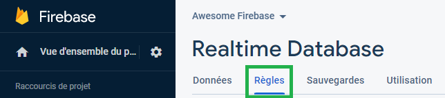
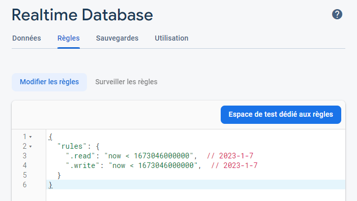
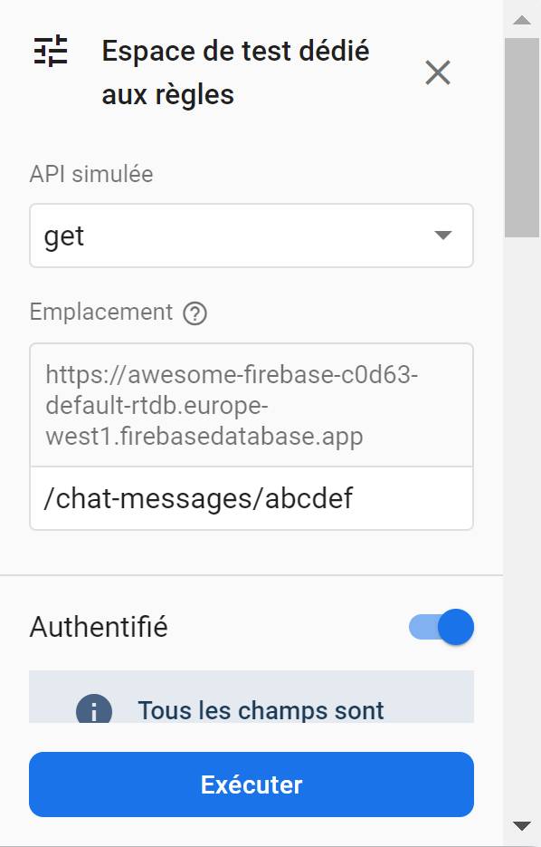

# Écrire des règles de sécurité

À l'issue de ce module, vous serez capable de :

1. Comprendre le fonctionnement des règles de sécuritésécurité
2. Écrire vos règles de sécurité en fonction de vos données

---

## Présentation

Les règles de sécurité sont essentielles pour éviter que n'importe qui accède ou altère les données présentes dans la base.

Le sujet des règles de sécurité de Firebase est très vaste et comporte de nombreuses subtilités et spécificités.

Dans ce chapitre, nous allons aborder les bases pour écrire des règles simples sur des données simples.

## Qu'est-ce qu'une règle ?

Les règles de sécurité s'écrivent directement dans la **console Firebase**, dans l'onglet _« Rules »_ du menu _« Realtime Database »_ :

<p align="center"></p>

Par défaut, les règles spécifiées pour le **mode test** précédemment choisi ressemblent pour l'instant à :

<p align="center"></p>

La clé racine `rules` est obligatoire, et contient les règles pour l'ensemble des noeuds de la base de données.

## Types de règles

Il existe 4 différents **types** de règles :

- `.read` : Permet de décrire si (et quand) la donnée peut être **lue** depuis la base.
- `.write` : Permet de décrire si (et quand) la donnée peut être **écrite** dans la base.
- `.validate` : Permet de contrôler la validité d'une donnée (formatage, structure, type).
- `.indexOn` : Permet de définir des index sur les champs pour améliorer les performances lors des requêtes.

Chaque type nécessite une condition comme valeur finale. Par exemple :

```json
{
  "rules": {
    ".read": "true",
    ".write": "false"
  }
}
```

Ici, tout le monde peut lire la base (comprendre : tous les noeuds disponibles à la racine), mais personne ne peut y écrire.

## Structure des règles

L'écriture des règles doit dépendre de la structure de vos données.

Admettons la structure de données suivante dans la base, avec un noeud `comments` et un noeud `chat-messages` :

```json
{
  "comments": {
    "-39c3c21e-04e": {
      "author": "John D.",
      "text": "Hello World!",
      "created_at": "2022-12-14",
    },
    "-878fd55f-b82": {
      "author": "James S.",
      "text": "Hey",
      "created_at": "2022-12-14",
    },
  },

  "chat-messages": {
    "-04fdb527-8fc": { "message": "Hello!" },
    "-c59331b9-0f7": { "message": "Hey there!" },
  }
}
```

En écrivant des règles qui suivent **la même structure de données**, on peut avoir différents comportement pour différents noeuds :

```json
{
  "rules": {
    "comments": {
      ".read": true,
      ".write": false,
    },

    "chat-messages": {
      ".read": true,
      ".write": true
    }
  }
}
```

Ici, n'importe qui pourra lire et écrire dans le noeud `chat-messages`, mais le noeud `comments` n'est accessible qu'en lecture seule :

```js
const commentsRef = ref(db, '/comments');

await get(commentsRef); // ✅ AUTORISÉ
push(commentsRef, { … }); // ❌ REFUSÉ
```

À noter que ces règles `.read` et `.write` s'appliquent en cascade, ce qui signifie que la première règle trouvée et validée est prioritaire, et ce même sur les noeuds enfants.

```json
{
  "rules": {
    ".read": true, // ✅ AUTORISÉ

    "comments": {
      ".read": false, // ❌ Règle ignorée : on peut lire sur /comments
    }
  }
}
```

Dans cet exemple, si on tente de lire le noeud `/comments`, la lecture est autorisée car la règle `.read: true` est la première trouvée dans l'arborescence.

#### Capture de noeud

Admettons de nouveau les données suivantes pour les messages d'un tchat :

```json
{
  "chat-messages": {
    "-04fdb527-8fc": { "message": "Hello!" },
    "-c59331b9-0f7": { "message": "Hey there!" },
    // ...
  }
}
```

Si on souhaite définir un accès en lecture pour ces deux noeuds, on pourrait l'écrire de la façon suivante :

```json
{
  "rules": {
    "chat-messages": {
      "-04fdb527-8fc": { ".read": true },
      "-c59331b9-0f7": { ".read": true },
      // ...
    }
  }
}
```

Cependant cela signifie devoir écrire en dur les identifiants de chaque noeud dans les règles, ce qui est bien sûr non envisageable pour une application en production.

Il est possible de cibler des noeuds de façon dynamique en utilisant le symbole de capture `$` :

```json
{
  "rules": {
    "chat-messages": {
      "$messageId": { ".read": true },
    }
  }
}
```

Maintenant, tous les noeuds de messages `/chat-messages/<IDENTIFIANT>` seront concernés par la règle `.read`.

Cette variable est bien sûr réutilisable au besoin dans les conditions de règles, que nous verrons dans un instant.

Maintenant que nous avons vus la structure des règles de sécurité et comment capturer des noeuds de façon dynamique, nous allons nous concentrer sur l'écriture des conditions pour contrôler plus finement les droits.

## Les variables

Les règles Firebase proposent l'utilisation de [variables](https://firebase.google.com/docs/database/security/rules-conditions?authuser=0#the_auth_variable) pour offrir plus de possibilités dans les conditions.

Les variables sont fournies par le moteur de Firebase pour chaque requête effectuée par un client.

#### La variable `auth`

Elle contient les informations d'un utilisateur **authentifié via Firebase Authentication**. Si l'utilisateur effectuant la requête n'est pas authentifié, la variable vaudra `null`

```json
{
  "rules": {
    "chat-messages": {
      ".read": "auth !== null",
      ".write": "auth !== null"
    }
  }
}
```

#### La variable `newData`

Cette variable concerne les opération d'écriture (création et modification) d'une donnée.

Elle représente la donnée entrante qui sera écrite dans le noeud (si l'opération est autorisée).

Par exemple si on tente d'écrire le nouveau noeud `/chat-messages/abcdef` :

```js
set(ref(db, '/chat-messages/abcdef'), { message: "Salut !" });
```

Dans ce contexte, la valeur de la variable `newData` serait la donnée :

```js
{ message: "Salut !" }
```

#### La variable `data`

Cette variable concerne l'écriture et représente une donnée possiblement déjà existante dans la base à cet emplacement.

Si la valeur n'existe pas, alors la variable vaudra `null`

Amettons que la base contienne déjà le commentaire `abcdef` suivant :

```json
{
  "chat-messages": {
    "-04fdb527-8fc": { "message": "Hello!" },
    "-c59331b9-0f7": { "message": "Hey there!" },
    "-48a894de-b39": { "message": "Hi!" },
    "abcdef": { "message": "Salut !" },
  }
}
```

Si on applique une opération d'écriture sur ce noeud de façon suivante :

```js
set(ref(db, '/chat-messages/abcdef'), {
  message: "Salut les gens !"
});
```

… la valeur de variable `data` serait la donnée déjà existante **avant modification**, à savoir ici :

```js
{ "message": "Salut !" }
```

La valeur de `newData` quant à elle serait la nouvelle valeur à écrire, à savoir :

```js
{ "message": "Salut les gens !" }
```

On peut utiliser des méthodes sur ces variables pour connaître leur existance ou non :

```js
data.exists() // Indique si la donnée existe déjà

newData.exists() // Indique si la nouvelle donnée existe (ex: vaudra `false` pour une suppression)

data.hasChild('message') // Indique si la donnée contient un champs "message"

data.child('message').val() // Accède à la valeur du champs "message" de la donnée

newData.hasChildren(['message', 'date_created']) // Indique si la donnée contient les champs "message" et "date_created"
```

Il est conseillé de lire la documentation pour avoir un aperçu de toutes les possibilités offertes par ces variables : https://firebase.google.com/docs/database/security/rules-conditions?authuser=0#the_auth_variable

## Valider les données avec `.validate`

La règle `.validate` est légèrement différente à `.write` dans le sens où elle permet de contrôler la validité d'une donnée entrante.

On peut par exemple souhaiter que certains champs soient en String et d'autres en Number, ou représentent une date valide.

Contrairement à `.read` et `.write`, toutes les règles `.validate` qui concernent le noeud spécifié doivent être validées pour que l'opération soit autorisée.

Admettons que l'on souhaite avoir en base un message avec obligatoirement un texte et une date valide :

```js
{
  "message": "Salut les gens !",
  "created_at": "2022-12-13",
}
```

Il faudrait écrire pour cela les règles `.validate` suivantes :

```js
{
  "rules": {
    "chat-messages": {
      "$messageId": {
        "message": { ".validate": "newData.isString()" },
        "created_at": { ".validate": "newData.isString() && newData.val().matches(/^\d{4}-\d{1,2}-\d{1,2}$/)" },
        "$other": { ".validate": false }
      }
    }
  }
}
```

Grâce à cette règle, les noeuds ne doivent avoir que deux champs `message` et `created_at` étant des chaînes de caractères, et une date formatée en `YYYY-MM-DD`

## Autoriser en fonction des utilisateurs

Pour faire un récapitulatif des éléments abordés, nous allons imaginer une base de données stockant les informations suivantes pour une application de chat en ligne :

```json
{
  "chat-messages": {
    "-NJB32w8zkWPM1BS46Uv" : {
      "uid": "48E34ymLF2VsabGflvYRhLMCRTj2",
      "message": "Salut",
      "author": "John Doe",
      "created_at": "2022-12-14"
    },
    
    "-kWPRhzkWF2VsaMCRTj" : {
      "uid": "AMlQ02wKbBbMky6ZPrf8molkCxZ2",
      "message": "Hello tout le monde !",
      "author": "James Smith",
      "created_at": "2022-12-15"
    },
  }
}
```

Notez que pour chaque message, le paramètre `uid` doit correspondre à l'identifiant de l'utilisateur authentifié avec Firebase.

Nous souhaiterions que les utilisateurs authentifiés puissent … :

- … poster un nouveau message avec leur `uid` personnel (_bien évidemment, ils ne devraient pas pouvoir écrire un autre **uid** que le leur pour ne pas usurper l'identité d'un autre_)
- … modifier ou supprimer leurs propres messages uniquement
- … que chaque message soit composé des uniques champs "uid", "author", "message" et "created_at"

On peut écrire les règles suivantes :


```json
{
  "rules": {
    "chat-messages": {
      ".read": "auth !== null",

      "$messageId": {
        ".write": "!data.exists() || data.child('uid').val() === auth.uid",
        
        "uid" : { ".validate": "newData.val() === auth.uid" },
        "author": { ".validate": "newData.isString()" },
        "message": { ".validate": "newData.isString()" },
        "created_at": { ".validate": "newData.isString()" },
        "$other": { ".validate": false }
      }
    }
  }
}
```

Décorticons les différentes conditions. Pour commencer, on veut que seuls les utilisateurs authentifiés peuvent lire le noeud `chat-messages` :

```json
{ ".read": "auth !== null" }
```

Puis, on permet d'écrire si le message n'existe pas encore. Mais si il existe, on s'assure qu'il appartient à l'auteur de la requête (pour une modification ou suppression) :

```json
{ ".write": "!data.exists() || data.child('uid').val() === auth.uid" }
```

Enfin, on vérifie la structure de la donnée entrante (qu'il s'agisse d'une modification ou création) : Le `uid` écrit doit être celui de l'utilisateur faisant la requête, les autres champs doivent être des chaînes de caractères, et il ne peut pas y avoir d'autres champs que les 4 définis (grâce à la capture `$other`) :

```json
{
  "uid" : { ".validate": "newData.val() === auth.uid" },
  "author": { ".validate": "newData.isString()" },
  "message": { ".validate": "newData.isString()" },
  "created_at": { ".validate": "newData.isString()" },
  "$other": { ".validate": false }
}
```

---

# Pour aller plus loin

- [Understand Firebase Realtime Database Security Rules](https://firebase.google.com/docs/database/security?authuser=0)
- [Structure Secutiry Rules](https://firebase.google.com/docs/database/security/core-syntax?authuser=0)
- [Write Conditions for Secutiry Rules](https://firebase.google.com/docs/database/security/rules-conditions?authuser=0)

# Vos points clés à retenir

- Il existe 4 types de règles différents
- Les règles doivent suivre la structure des données
- On peut utiliser des variables pour vérifier les données et l'authentification

# Conclusion

Comprendre les subtilités du fonctionnement des règles de sécurité n'est pas toujours facile au début. Cependant il est important de ne jamais négliger la sécurité de vos données, et celle de vos utilisateurs.

C'est pourquoi il vous est conseillé de **relire** et surtout **de tester** vos règles, soit avec le SDK JavaScript, ou via la console avec **l'espace de test dédié aux règles**, dans lequel vous pouvez tester tout type d'opérations :

<p align="center"></p>

Félicitations d'avoir fini ce chapitre ! C'était un gros morçeau.

Vous avez maintenant toutes les clés en main pour concevoir et réaliser des applications web en temps réel.