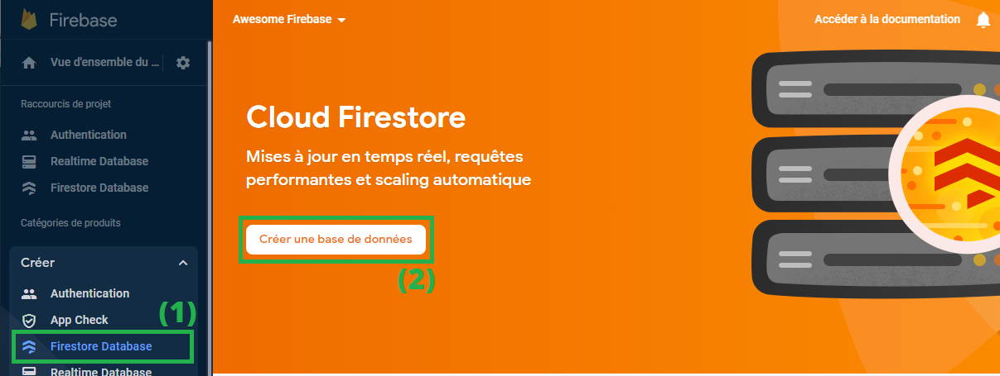
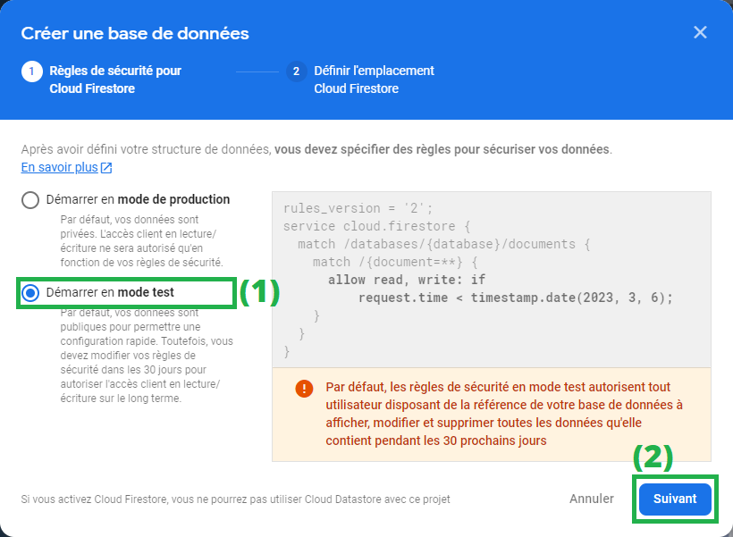
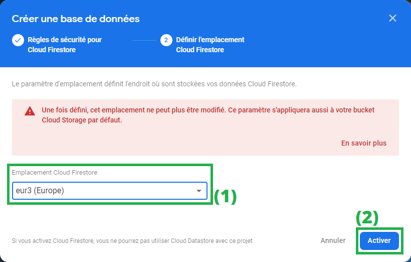
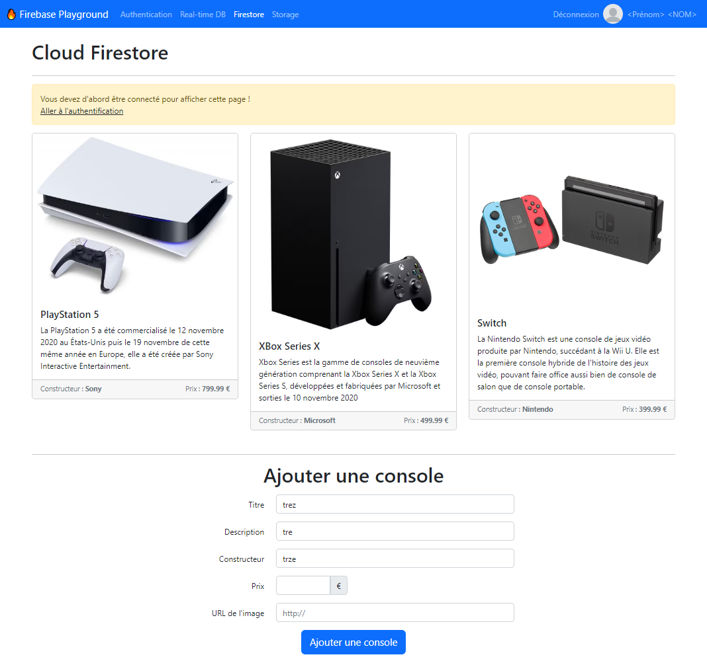

# Importer le service Firestore dans la page web

À l'issue de ce module, vous serez capable de :

1. Activer le service Firestore dans la console
2. Importer le service « _firestore_ » du SDK JavaScript dans une page web

---

## Présentation

Comme tous les services de Firebase vus jusqu'à présent, le service **Firestore** doit être activé et géré depuis [la console Firebase](https://console.firebase.google.com/).

Une fois correctement configuré, nous pourrons intéragir avec ce service depuis une page web grâce au SDK JavaScript.

## Activez Firestore

Rendez-vous dans le menu de gauche `Créer >> Firestore Database`<sup>(1)</sup>, puis cliquez sur le bouton « **Créer une base de données** » <sup>(2)</sup> :

<p align="center"></p>

Firebase vous demande de choisir le mode de stockage de vos données. Afin de pouvoir tester le service, choisissez pour l'instant le mode **test** :

<p align="center"></p>

> _(Ce mode va permettre d'ouvrir la base en accès lecture et écriture pour faire des tests. Nous étudierons plus tard les règles de sécurité.)_

Enfin, Firebase vous demande le paramètre d'emplacement de vos futures données. En règle générale, il faut se poser la question de la proximité géographique du serveur en fonction des utilisateurs de l'application.

Si vous créez une application pour des utilisateurs basés aux USA, il vaut mieux choisir un emplacement plus proche de cet endroit.

Pour notre application de test, choisissons la zone "_Europe_" :

<p align="center"></p>

Et voilà ! Votre base de données Firestore est configurée et prête à l'emploi !

Ne reste qu'à importer le SDK JavaScript dans la page web pour continuer.

## Créer le fichier pour Firestore

Dans le projet « Firebase Playground » se trouve une page `public/firestore.html`.

Ouvrez-la avec _Live Server_.

<p align="center"></p>

C'est sur cette page que vous allez travailler pour tout ce qui concerne la partie _Firestore_ dans ce cours.

Afin de rester organisé, il va falloir une nouvelle fois créer un fichier JavaScript à associer à cette page, en utilisant Webpack.

Créez un nouveau fichier de script : `public/scripts/firestore.js`

Modifiez ensuite la configuration de `webpack.config.js` pour ajouter une nouvelle entrée :

```js
…
entry : {
  // …
  firestore: './public/scripts/firestore.js',
}
```

N'oubliez pas d'inclure le fichier compilé `bundle/firestore.js` dans la page HTML :

```html
<head>
  …
  <script src="bundle/firestore.js" defer></script>
</head>
```

Enfin, relancez la commande `npm run dev` dans le terminal.

Voyons maintenant l'import du SDK JavaScript concernant **Firestore**.

## Importer le service _Firestore_

Le fonctionnement de ce service repose sur le même principe que ceux vus précédemment. Il faut créer une **instance** :

```js
// 1. Import de l'objet qui référence notre application Firebase pré-configurée
import { app } from './index';

// 2. Import de la fonction "getFirestore' depuis le package "firebase/firestore"
import { getFirestore } from 'firebase/firestore';

// 3. Création d'une "instance" du service Database pour l'application "app"
const db = getFirestore(app);
```

Ajoutez cela dans le fichier `firestore.js`

Et voilà. Vous avez importé le service Firestore dans votre page web et pourrez commencer à utiliser les différentes méthodes pour intéragir avec la base de données.

Dans les prochains chapitres, nous allons étudier ces méthodes pour manipuler les données.

---

# Pour aller plus loin

- [Get started with Cloud Firestore](https://firebase.google.com/docs/firestore/quickstart)
- Documentation : [getFirestore()](https://firebase.google.com/docs/reference/js/firestore_?hl=en#getfirestore)

# Vos points clés à retenir

- Le service Firestore doit être activé depuis la console Firebase
- L'instance du service se créer avec la fonction `getFirestore()`
- L'instance créée va permettre d'utiliser les fonctions du SKD JavaScript relatives à Firestore

# Conclusion

Et voilà ! Vous avez créé votre première base de données Firestore.

Avant d'aller plus loin, voyons ensemble en vidéo le panneau de contrôle de Firestore depuis la Console Firebase.

À tout de suite dans le prochain chapitre !
