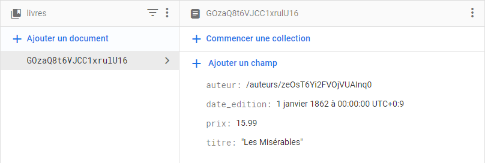

# 06AN - Références de collection et de document

À l'issue de ce module, vous serez capable de :

1. Savoir ce qu'est une référence
2. Savoir comment récupérer les références de collection et de document

---

## Présentation

Une référence correspond à une sorte de **pointeur** vers une collection ou un document. On s'en sert pour se positionner dans la base de données, et pour manipuler les documents.

## Récupérer une référence de collection

Pour récupérer une référence de collection, on utilise la fonction `collection` du package `firebase/firestore`.

```js
import { getFirestore, collection } from 'firebase/firestore';

// Récupère l'instance de Firestore
const db = getFirestore(app);

// Récupère la référence de la collection nommée : "livres"
const booksCollection = collection(db, 'livres');
```

La constante `booksCollection` représente la collection `livres` de la base de données.
Elle est de type [CollectionReference](https://firebase.google.com/docs/reference/js/firestore_.collectionreference?hl=en).

Cette référence de collection sera utile pour créer plus tard des requêtes sur la collection ciblée.

## Récupérer une référence de document

Une référence de document permet de **se positionner un document précis en vue de sa manipulation** (lecture, modification, suppression ou surveillance d'un changement).

Admettons le document portant l'ID `GOzaQ8t6VJCC1xrulU16` et se trouvant dans la collection `livres` :

<p align="center"></p>

On peut alors obtenir la référence pointant vers ce document avec la fonction `doc` du package `firebase/firestore` :

```js
const bookRef = doc(booksCollection, 'GOzaQ8t6VJCC1xrulU16');
```

Comme vous le voyez, il faut au préalable connaître la référence de la collection dans laquelle se trouve le document ciblé.

Cela dit, on peut aussi préciser directement le chemin complet vers le document avec cette autre syntaxe :

```js
const bookRef = doc(db, 'livres/GOzaQ8t6VJCC1xrulU16');
```

Cela revient au même. On récupère bien un objet de type [DocumentReference](https://firebase.google.com/docs/reference/js/firestore_.documentreference?hl=en) dans `bookRef`.


Cette référence de document sera utile pour manipuler les données s'y trouvant (lecture, modification, suppression et mise-à-jour).

---

# Pour aller plus loin

- Documentation : [getFirestore()](https://firebase.google.com/docs/reference/js/firestore_.md?hl=fr#getfirestore)
- Documentation : [collection()](https://firebase.google.com/docs/reference/js/firestore_.md?hl=fr#collection)
- Documentation : [doc()](https://firebase.google.com/docs/reference/js/firestore_.md?hl=fr#doc)

# Vos points clés à retenir

- La référence d'une collection s'obtient avec la fonction `collection` du package `firebase/firestore`.
- La référence d'un document s'obtient avec la fonction `doc` du package `firebase/firestore`.
- Ces références permettront de se positionner sur une collection ou un document pour les requêter, les manipuler, les surveiller, etc.

# Conclusion

Vous savez maintenant comment référencer une collection et un document. Rendez-vous dans le prochain chapitre pour voir comment les utiliser pour requêter la base de données.