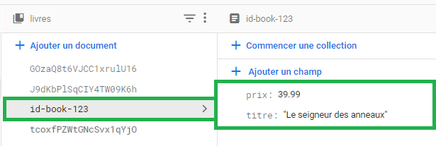
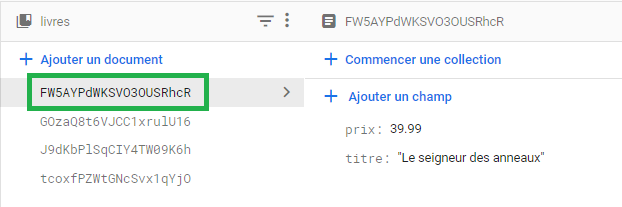

# Insérer, modifier et supprimer un document

À l'issue de ce module, vous serez capable de :

1. Créer et ajouter des documents dans une collection
2. Modifier des documents existants
3. Supprimer des documents existants

---

## Présentation

Vous avez appris à récupérer de façon avancée des documents dans une collection. Dans ce chapitre, nous allons maintenant voir le reste des opérations pour _insérer_, _modifier_ et _supprimer_ des documents.

## Insérer des documents

Il existe deux façons d'insérer un document dans une collection :

1. En créant un document vide auquel on assigne un ID et des données
2. En créant un document avec un ID généré automatiquement et des données

#### Créer un document vide

Une nouvelle fois, nous allons utiliser la fonction `doc()` pour créer une référence de document avec un ID manuel :

```js
const newDocRef = doc(booksCollection, 'id-book-123');
```

Une fois la référence créée, nous pouvons utiliser la fonction asynchrone `setDoc()` pour insérer les données dans le document :

```js
await setDoc(newDocRef, {
  titre: 'Le seigneur des anneaux',
  prix: 39.99
});
```

Le document est maintenant inséré dans la collection `books` :

<p align="center">
  
</p>

#### Avec un ID généré automatiquement

Avec cette dernière méthode, il faut manuellement gérer le nouvel identifiant. Si l'on souhaite laisser Firestore générer un nouvel identifiant, on utilisera plutôt la fonction `addDoc()` :

```js
const newDocRef = await addDoc(booksCollection, {
  titre: 'Le seigneur des anneaux',
  prix: 39.99
});

console.log(`Nouveau document inséré avec l'ID ${newDocRef.id}`);
```

La génération de l'identifiant est laissée à Firestore :

<p align="center">
  
</p>

L'ajout de référence se fait en utilisant l'objet de référence. Ainsi, si l'on souhaite créer un nouveau livre d'un nouvel auteur, on peut procéder comme suit :

```js
// Ajout du nouvel auteur
const authorsCollection = collection(db, 'auteurs');
const newAuthorRef = await addDoc(authorsCollection, {
  nom: 'Tolkien',
  prenom: 'John Ronald Reuel',
});
console.log(`Nouvel auteur inséré avec l'ID ${newAuthorRef.id}`);

// Ajout du nouveau livre, avec référence vers l'auteur "newAuthorRef"
const newBookRef = await addDoc(booksCollection, {
  titre: 'Le seigneur des anneaux',
  prix: 39.99,
  date_edition: new Date('1954-07-29'),
  auteur: newAuthorRef, // Référence vers l'auteur "Tolkien"
});
console.log(`Nouveau livre inséré avec l'ID ${newBookRef.id}`);
```

## Modifier des documents

La modification de documents se fait à l'aide de la fonction `updateDoc()`. Elle prend en paramètre une référence de document et un objet contenant uniquement les champs à modifier :

```js
import { doc, updateDoc } from 'firebase/firestore';

/* Récupère la référence vers le document "auteur" suivant :
  {
    nom: "Hugo",
    prenom: "Victor"
  }
*/
const victorHugoRef = doc(db, 'auteurs/zeOsT6Yi2FVOjVUAInq0');

await updateDoc(victorHugoRef, {
  nom: 'HUGO'
});

/* Le document "auteur" est maintenant :
  {
    nom: "HUGO",
    prenom: "Victor"
  }
*/
```

## Supprimer des documents

Pour supprimer un document, il suffit d'utiliser la fonction `deleteDoc()` en passant en paramètre la référence du document à supprimer :

```js
import { doc, deleteDoc } from 'firebase/firestore';

const victorHugoRef = doc(db, 'auteurs/zeOsT6Yi2FVOjVUAInq0');
await deleteDoc(victorHugoRef);
```

#### Supprimer certains champs de document

Dans le cas où l'on souhaite parfois retirer des champs d'un document, Firestore fournit la fonction `deleteField()` que l'on applique avec une opération de modification :

```js
import { doc, updateDoc, deleteField } from 'firebase/firestore';

const victorHugoRef = doc(db, 'auteurs/zeOsT6Yi2FVOjVUAInq0');
await updateDoc(victorHugoRef, {
  prenom: deleteField(),
  nom: 'Victor HUGO'
});

/* Le document "auteur" est maintenant :
  {
    nom: "Victor HUGO"
  }
  Le champs "prenom" a été supprimé
*/
```

---

# Pour aller plus loin

- [Add data to Cloud Firestore](https://firebase.google.com/docs/firestore/manage-data/add-data?hl=en)
- [Delete data from Cloud Firestore](https://firebase.google.com/docs/firestore/manage-data/delete-data?hl=en)

# Vos points clés à retenir

- La création de documents se fait à l'aide des fonctions `setDoc()` et `addDoc()`
- La modification de documents se fait à l'aide de la fonction `updateDoc()`
- La suppression de documents se fait à l'aide de la fonction `deleteDoc()`

# Conclusion

Vous savez maintenant gérer les données de votre base Firestore. Il est toutefois conseillé de lire en détail les pages de documentation proposées ci-dessus pour voir tous les cas de figures possibles, notamment pour la gestion des types de données (tableaux, objets, dates, etc.), mais aussi les "_converters_", incrémenter des valeurs existantes, ou encore comment supprimer une collection entière.

Prenez le temps de lire ces pages de documentation, et vous serez prêt à passer à la suite !