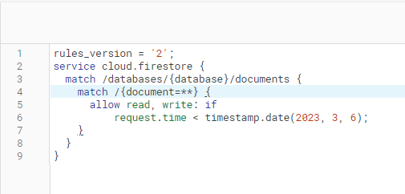

# Écrire des règles de sécurité

À l'issue de ce module, vous serez capable de :

1. Comprendre le fonctionnement des règles de sécurité
2. Écrire vos règles de sécurité en fonction de vos données

---

## Présentation

Les règles de sécurité fournissent le **contrôle d'accès** et la **validation des données** dans un format simple et expressif.

Pour créer des systèmes d'accès basés sur les utilisateurs et les rôles qui protègent les données de vos utilisateurs, vous devez utiliser **Firebase Authentication** avec les **règles de sécurité Cloud Firestore**.

> **Warning**
>
> Par défaut, les règles de sécurité utilisent la version 1 de l'API de sécurité.
> La version 2 apporte quelques fonctionnalités en plus, mais elle change aussi le comportement de l'opérateur `{name=**}` que nous utiliserons dans ce chapitre.
> Faites attention à bien utiliser la version 1 de l'API de sécurité dans ce cours, ou consulter la [documentation pour la version 2](https://firebase.google.com/docs/firestore/security/get-started?hl=en).

Les règles de sécurité s'écrivent directement dans la **console Firebase**, dans l'onglet _« Règles »_ du menu _« Firestore Database »_ :

<p align="center"></p>

Par défaut, les règles spécifiées pour le **mode test** précédemment choisi ressemblent pour l'instant à ceci :

<p align="center"></p>

## Écrire des règles simples

### Structure des règles

Les règles de sécurité Firestore diffèrent des règles de sécurité Real-time Database en terme de syntaxe.

Elles permettent de cibler les **documents** de la base de données et proposent des expressions conditionnelles pour permettre l'accès à ces documents.

Les règles démarrent **toujours** avec la déclaration suivante :

```text
service cloud.firestore {
  match /databases/{database}/documents {
    
  }
}
```

La déclaration `service cloud.firestore` indique que les règles s'appliquent à Cloud Firestore (ce qui évite l'entrée en conflit avec d'autres règles de sécurité comme pour Storage, que nous verrons dans le module suivant).

La déclaration `match /databases/{database}/documents` indique que les règles qui suivront s'appliqueront à toutes les bases de données présentes dans le projet.

### Règles basiques

Les règles basiques consistent à définir des chemins vers des documents et à leur appliquer des règles d'accès comme la lecture ou l'écriture.

On déclare un chemin vers un document en utilisant la déclaration `match` :

```text
service cloud.firestore {
  match /databases/{database}/documents {

    match /cities/{city} {
      allow read: if <condition>;
      allow write: if <condition>;
    }
    
  }
}
```

Comme on le constate ci-dessus, la déclaration `match /cities/{city}` permet de cibler tous les documents de la collection `cities`.

Pour ces documents, on va autoriser la lecture et l'écriture en fonction de la `<condition>`.

On peut aussi décomposer la lecture et l'écriture de façon plus précise :

- `read` : peut être décomposé par `get` ou `list`
- `write` : peut être décomposé par `create`, `update` ou `delete`

**Exemple :**

```text
match /cities/{city} {
  allow get: if <condition>; // S'applique à la lecture d'un seul document
  allow list: if <condition>; // S'applique à la lecture de plusieurs documents (queries)

  allow create: if <condition>; // S'applique aux documents non existants
  allow update: if <condition>; // S'applique aux modifications de documents
  allow delete: if <condition>; // S'applique aux suppressions de documents
}
```

On peut aussi les combiner au besoin :

```text
match /cities/{city} {
  allow create, update: if <condition>;
}
```

### Règles imbriquées

Il est important de comprendre également qu'une règle qui s'applique à un document ne va pas s'appliquer automatiquement à ses sous-documents (dans le cas de sous-collections).

Admettons une collections `posts` qui contient des documents de type `post` et des sous-documents de type `comment`. Dans le code qui suit, la règle `allow read` s'applique uniquement aux documents de type `post`, **mais pas aux sous-documents de type `comment`** :

```text
match /posts/{post} {
  allow read: if <condition>; // ⚠️ Ne s'applique qu'aux `post`
}
```

Si on voulait que la règle s'applique aux sous-documents, il faudrait l'indiquer explicitement :

```text
match /posts/{post} {
  allow read: if <condition>; // ⚠️ Ne s'applique qu'aux `post`

  match /comments/{comment} {
    allow read: if <condition>; // ✅ S'applique aux `post` et aux `comment`
  }
}
```

À noter qu'il est possible de définir des règles à plusieurs niveaux d'imbrication grâce au _wildcard_ `{name=**}` :

```text
match /posts/{document=**} {
  allow read: if <condition>; // ✅ S'applique aux `post` et aux `comment`
}
```

## Écrire les conditions de règles

Nous avons vu précédemment comment définir des règles de sécurité pour les documents de notre base de données.

Voyons maintenant plus précisément ce qu'il est possible de faire avec ces `<condition>`.

Globalement, une condition de règle est une expression booléenne qui détermine si une opération sur une ressource (document(s)) est autorisée ou non.

On peut valider à l'aide d'une condition les informations suivantes :

- Vérifier l'identité de l'utilisateur connecté (Authentication)
- Valider les données envoyées dans la requête
- Accéder à des données externes (Firestore, Real-time Database, Storage, etc.)

### Vérifier l'identité de l'utilisateur connecté

Un pattern très courant consiste à vérifier l'identité de l'utilisateur connecté pour déterminer si une opération est autorisée ou non.

Les informations de cet utilisateur se trouvent dans la variable `request.auth`.

On peut ainsi autoriser l'accès à une collection uniquement si l'utilisateur est connecté :

```text
match /posts/{post} {
  allow read: if request.auth != null;
}
```

On peut aussi accéder à l'information stockée dans le document ciblé via la variable `resource.data`. Cela permet par exemple de pouvoir vérifier si l'utilisateur connecté est bien le propriétaire du document qu'il souhaite modifier :

```text
match /posts/{post} {
  allow update: if request.auth.uid == resource.data.owner;
}
```

Dans l'exemple ci-dessus, on vérifie que l'identifiant de l'utilisateur connecté (`request.auth.uid`) est égal à l'identifiant du propriétaire du document (`resource.data.owner`).

Ainsi, si notre utilisateur connecté a pour identifiant `123` et que le document qu'il souhaite modifier a pour propriétaire `456`, alors la condition sera fausse et l'opération sera refusée :

```text
posts/
├── post1/ ✅ Modification autorisée pour l'utilisateur connecté `123`
│   ├── title -> "Post n°1"
│   └── owner -> "123"
└── post2/ ❌ Modification refusée pour l'utilisateur connecté `123`
    ├── title -> "Post n°1"
    └── owner -> "456"
```

### Valider les données envoyées dans la requête

On peut également valider les données envoyées dans la requête lors d'une opération `create` ou `update`.

On utilise pour cela la variable `request.resource.data`.

> **Warning**
>
> Les variables `resource.data` et `request.resource.data` ne représentent pas la même chose :
> `resource.data` représente les données du **document ciblé** par la requête, alors que `request.resource.data` représente **les données envoyées de la requête envoyées par le client**.

On pourrait donc imaginer une règle qui permet de vérifier que le titre d'un post ne dépasse pas 100 caractères :

```text
match /posts/{post} {
  allow create, update: if request.resource.data.title.size() <= 100;
}
```

Ou encore une règle qui vérifie que les données envoyées par le client sont bien de type `string` :

```text
match /posts/{post} {
  allow create, update: if request.resource.data.title is string;
}
```

Il est possible de contrôler ces données de façon plus précises en utilisant d'autres fonctionnalités comme les [fonctions de validation](https://firebase.google.com/docs/firestore/security/rules-conditions?hl=en#functions) ou encore les [expressions régulières](https://firebase.google.com/docs/firestore/security/rules-conditions?hl=en#regular_expressions).

N'hésitez pas à consulter la [documentation officielle](https://firebase.google.com/docs/firestore/security/rules-conditions?hl=en) pour en savoir plus à propos des règles de sécurité.

---

# Pour aller plus loin

- Video YouTube : [Security Rules! 🔑 | Get to know Cloud Firestore](https://www.youtube.com/watch?v=eW5MdE3ZcAw)
- [Structure Security Rules](https://firebase.google.com/docs/firestore/security/rules-structure?hl=en#version-1)
- [Writing conditions for Security Rules](https://firebase.google.com/docs/firestore/security/rules-conditions?hl=en)

# Vos points clés à retenir

- Les règles Firestore définissent des chemins vers des documents avec la déclaration `match`.
- Chaque chemin peut déclarer des conditions permettant d'autoriser des opérations comme `read` et `write`.
- Dans les conditions, on peut accéder aux informations de l'utilisateur connecté, aux données envoyées dans la requête et aux données du document ciblé.
 

# Conclusion

Maintenant que vous savez les bases sur les règles de sécurité, il est temps de passer à un exercice pratique.

Rendez-vous dans le chapitre suivant pour mettre en pratique ce que vous venez d'apprendre.
