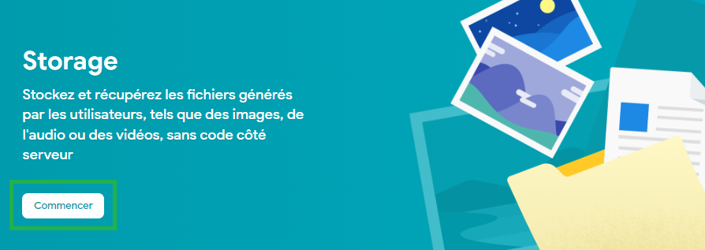
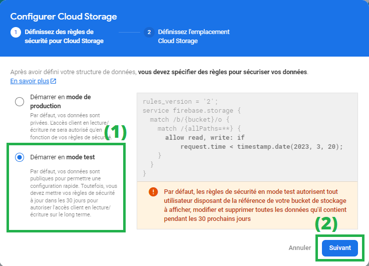
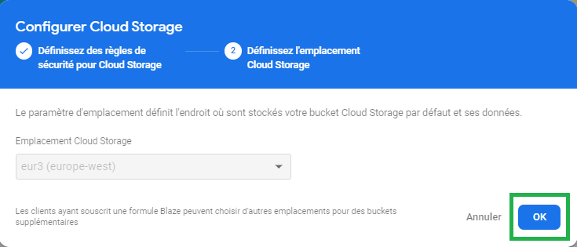
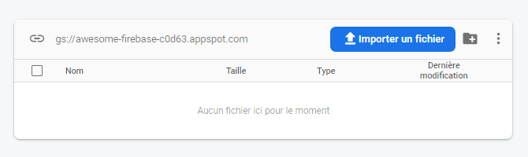
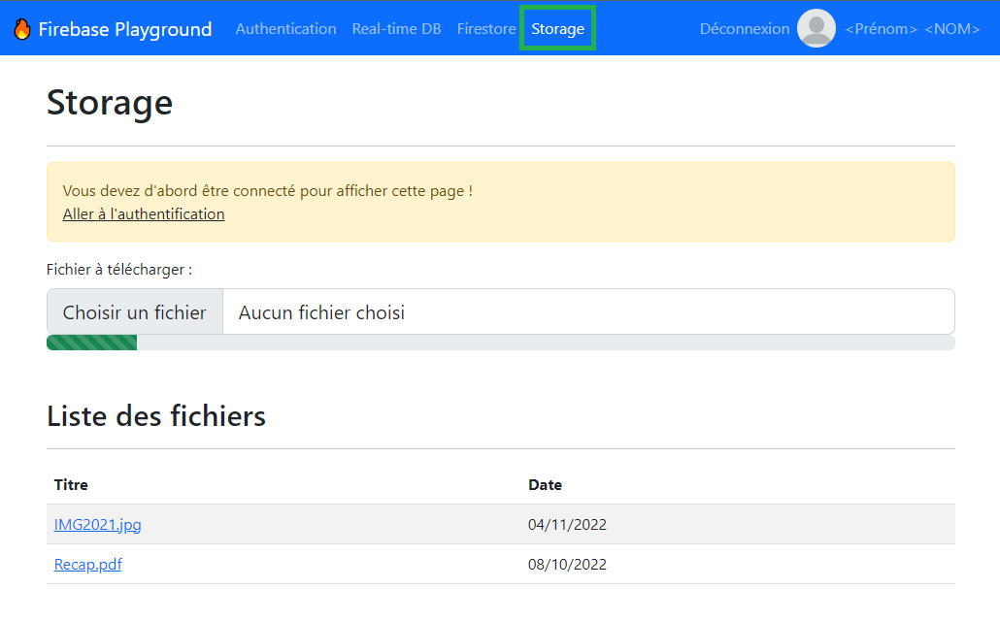
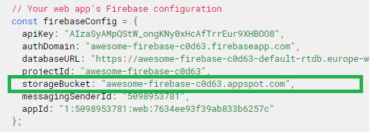

# Importer le service Storage dans la page web

À l'issue de ce module, vous serez capable de :

1. Définir ce qu'est Firebase Storage
2. Activer Firebase Storage dans la console
3. Importer le service « _storage_ » du SDK JavaScript dans une page web

---

## Présentation

Cloud Storage est un service de stockage de fichiers dans le cloud Google.

Il permet de stocker des fichiers de tout type (images, vidéos, documents, etc.) et de les partager avec des utilisateurs authentifiés.

C'est aussi un service scalable, capable de gérer des fichiers de plusieurs Petaoctets. Il propose en outre des fonctionnalités de gestion du réseau et de reprise de téléchargement.

## Activez le service dans la console

Avant de pouvoir utiliser ce service, il faut d'abord l'activer dans la console Firebase.

Rendez-vous dans le menu de gauche `Créer >> Storage`, puis cliquez sur le bouton « **Commencer** »

<p align="center"></p>

Comme pour les services vus précédemment, Firebase vous propose de définir les règles de sécurité pour Storage.

Nous allons commencer par le **mode test** pour nous familiariser avec le service. Nous verrons plus en détails les règles de sécurité dans un prochain chapitre.

Cliquez donc sur _Démarrer en mode test_ (1), puis sur _Suivant_ (2) :

<p align="center"></p>

À l'étape suivante, vous pouvez choisir la zone géographique dans laquelle vous souhaitez stocker vos fichiers. Pour ce cours, nous allons rester sur la zone par défaut : _europe-west_ :

<p align="center"></p>

Et voilà, vous devriez voir apparaître sur votre console votre premier **bucket** de stockage :

<p align="center"></p>

> Comme vous le constatez, il est possible d'envoyer des fichiers dans un bucket de stockage depuis la console. C'est une fonctionnalité très pratique pour tester le service, cependant nous allons voir comment procéder depuis une application web avec le **SDK JavaScript**.

## Créer le fichier pour Storage

Dans le projet « Firebase Playground » se trouve une page `public/storage.html`.

Ouvrez-la avec _Live Server_.

<p align="center"></p>

C'est sur cette page que vous allez travailler pour tout ce qui concerne la partie _Storage_ dans ce cours.

Afin de rester organisé, il va falloir une nouvelle fois créer un fichier JavaScript à associer à cette page, en utilisant Webpack.

Créez un nouveau fichier de script : `public/scripts/storage.js`

Modifiez ensuite la configuration de `webpack.config.js` pour ajouter une nouvelle entrée :

```js
…
entry : {
  // …
  storage: './public/scripts/storage.js',
}
```

N'oubliez pas d'inclure le fichier compilé `bundle/storage.js` dans la page HTML :

```html
<head>
  …
  <script src="bundle/storage.js" defer></script>
</head>
```

Enfin, relancez la commande `npm run dev` dans le terminal.

## Récupérer la configuration

L'activation de Storage donne une URL vers le « bucket » nouvellement créé. Cette URL est nécessaire pour le bon fonctionnement du SDK JavaScript, il faut donc mettre à jour la configuration du SDK JavaScript.

En retournant dans les paramètres du projet, une nouvelle ligne `storageBucket` est apparue dans la configuration.

<p align="center"></p>

Il faut mettre à jour cette nouvelle configuration dans le fichier `public/scripts/config.js` du projet JavaScript.

Voyons maintenant l'import du SDK JavaScript concernant **Storage**.

## Importer le service _Storage_

Le fonctionnement de ce service repose sur le même principe que ceux vus précédemment. Il faut créer une **instance** :

```js
// 1. Import de l'objet qui référence notre application Firebase pré-configurée
import { app } from './index';

// 2. Import de la fonction "getStorage' depuis le package "firebase/storage"
import { getStorage } from 'firebase/storage';

// 3. Création d'une "instance" du service Storage pour l'application "app"
const storage = getStorage(app);
```

Ajoutez cela dans le fichier `storage.js`

Et voilà. Vous avez importé le service Storage dans votre page web et pourrez commencer à utiliser les différentes méthodes pour intéragir avec les fichiers.

---

# Pour aller plus loin

- [Get started with Storage on Web](https://firebase.google.com/docs/storage/web/start?hl=en)
- Documentation : [getStorage()](https://firebase.google.com/docs/reference/js/storage?hl=en#getstorage)

# Vos points clés à retenir

- Le service Firebase Storage permet de stocker des fichiers dans le cloud.
- Pour utiliser ce service, il faut l'activer dans la console Firebase.
- On créer une instance du service de storage avec la fonction `getStorage()`
- L'instance créée va permettre d'utiliser les fonctions du SDK JavaScript relatives à ce service.

# Conclusion

Et voilà ! Vous avez créé votre premer bucket de stockage dans Firebase.

Mais d'ailleurs, qu'est-ce qu'un bucket ?

Avant de commencer à coder, voyons ensemble comment le définir dans le chapitre qui suit.
