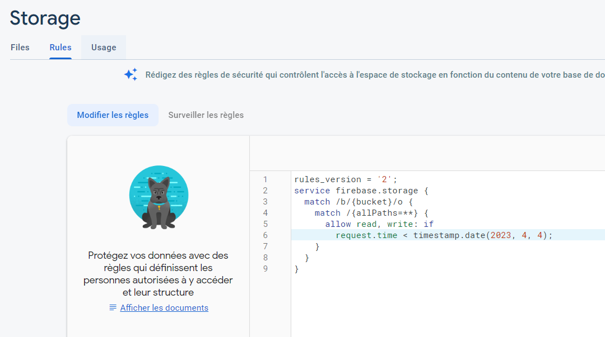

# 07AN - Écrire des règles de sécurité

À l'issue de ce module, vous serez capable de :

1. Comprendre le fonctionnement des règles de sécurité
2. Écrire vos règles de sécurité en fonction de vos données

---

## Présentation

Les règles de sécurité fournissent le **contrôle d'accès** et la **validation des données** dans un format simple et expressif.

Pour créer des systèmes d'accès basés sur les utilisateurs et les rôles qui protègent les données de vos utilisateurs, vous devez utiliser **Firebase Authentication** avec les **règles de sécurité Firebase Storage**.

> **Warning**
>
> Par défaut, les règles de sécurité utilisent la version 1 de l'API de sécurité.
> La version 2 de l'API de sécurité pour Storage doit être utilisée si l'on veut pouvoir utiliser les fonctions de listing `listAll()` `list()` vues précédemment, c'est pourquoi nous préfèrerons la version 2 dans ce module pour Storage.

Les règles de sécurité s'écrivent directement dans la **console Firebase**, dans l'onglet _« Règles »_ du menu _« Firestore Storage »_.

Par défaut, les règles spécifiées pour le **mode test** précédemment choisi ressemblent pour l'instant à ceci :

<p align="center"></p>

## Écrire des règles simples

> **Note**
>
> Vous remarquerez que les règles de sécurité pour Storage sont en de nombreux points similaires à celles de Firestore, ce qui est normal puisque les deux services sont très proches.
> Vous retrouverez donc beaucoup de similitudes entre les deux chapitres.

### Structure des règles

Les règles de sécurité pour _Firebase Storage_ sont assez similaires aux règles de sécurité de _Cloud Firestore_ en terme de syntaxe.

Elles permettent de cibler les **chemins** vers des références et proposent des expressions conditionnelles pour permettre l'accès à ces fichiers.

Les règles démarrent **toujours** avec la déclaration suivante :

```text
rules_version = '2';
service firebase.storage {
  // ...
}
```

La déclaration `service firebase.storage` indique que les règles s'appliquent à Cloud Storage (ce qui évite l'entrée en conflit avec d'autres règles de sécurité comme pour Firestore, vu précédemment).

On peut ensuite choisir d'appliquer des règles à tous les buckets :

```text
rules_version = '2';
service firebase.storage {
  match /b/{bucket}/o {
    // ...
  }
}
```

### Règles basiques

Les règles basiques consistent à définir des chemins vers des fichiers et à leur appliquer des règles d'accès comme la lecture ou l'écriture.

On déclare un chemin vers un document en utilisant la déclaration `match` :

```text
rules_version = '2';
service firebase.storage {
  match /b/{bucket}/o {

    match /images/{imageId} {
      allow read: if <condition>;
      allow write: if <condition>;
    }
    
  }
}
```

Comme on le constate ci-dessus, la déclaration `match /images/{imageId}` permet de cibler tous les fichiers du dossier `images`.

Pour ces fichiers, on va autoriser la lecture et l'écriture en fonction de la `<condition>`.

On peut aussi décomposer la lecture et l'écriture de façon plus précise :

- `read` : peut être décomposé par `get` ou `list`
- `write` : peut être décomposé par `create`, `update` ou `delete`

**Exemple :**

```text
match /images/{imageId} {
  allow get: if <condition>; // S'applique à la lecture d'un seul fichier
  allow list: if <condition>; // S'applique à la lecture de plusieurs fichiers (`list` et `listAll`)

  allow create: if <condition>; // S'applique aux fichiers non existants
  allow update: if <condition>; // S'applique aux modifications de fichiers
  allow delete: if <condition>; // S'applique aux suppressions de fichiers
}
```

On peut aussi les combiner au besoin :

```text
match /images/{imageId} {
  allow create, update: if <condition>;
}
```

### Règles imbriquées

Il est important de comprendre également qu'une règle qui s'applique à un fichier ne va pas s'appliquer automatiquement à tous les sous-dossiers à l'emplacement de la référence.

Admettons la structure suivante dans notre bucket :

```
images/
├── DSC00001.crw
├── DSC00002.crw
├── DSC00003.crw
├── png/
│   ├── DSC00001.png
│   ├── DSC00002.png
│   └── DSC00003.png
└── jpg/
    ├── DSC00001.jpg
    ├── DSC00002.jpg
    └── DSC00003.jpg
```

Le dossier `images` contient des fichiers RAW, et les sous-dossiers `/png` et `/jpg` contiennent les mêmes fichiers en version compressée.

Dans le code qui suit, la règle `allow read` va s'appliquer uniquement aux fichiers RAW **directement dans le dossier `images`, mais pas à ceux présents dans `/png` ou `/jpg`** :

```text
match /images/{imageId} {
  allow read: if <condition>; // ⚠️ Ne s'applique qu'aux fichiers RAW `.crw`
}
```

Si on voulait que la règle s'applique aux fichiers dans les sous-dossiers, il faudrait l'indiquer explicitement :

```text
match /images/{imageId} {
  allow read: if <condition>; // ⚠️ Ne s'applique qu'aux fichiers RAW `.crw`

  match /{format}/{imageIdCompressed} {
    allow read: if <condition>; // ✅ S'applique aux fichiers .png et .jpg des dossiers respectifs.
  }
}
```

À noter qu'il est possible de définir des règles à plusieurs niveaux d'imbrication grâce au _wildcard_ `{allPaths=**}` :

```text
match /images/{allPaths=**} {
  allow read: if <condition>; // ✅ S'applique à tous les fichiers et sous-fichiers du dossier `images`
}
```

## Écrire les conditions de règles

Nous avons vu précédemment comment définir des règles de sécurité pour les fichiers de notre bucket.

Voyons maintenant plus précisément ce qu'il est possible de faire avec ces `<condition>`.

Globalement, une condition de règle est une expression booléenne qui détermine si une opération sur une ressource (fichier(s)) est autorisée ou non.

On peut valider à l'aide d'une condition les informations suivantes :

- Vérifier l'identité de l'utilisateur connecté (Authentication)
- Valider les données envoyées dans la requête
- Accéder à des données externes (Firestore, Real-time Database, etc.)

### Vérifier l'identité de l'utilisateur connecté

Un pattern courant dans Storage consiste à **stocker les fichiers d'un utilisateur connecté avec Authentication** dans un dossier spécifique à son identifiant.

Par exemple, on pourrait avoir la structure de bucket suivante : 

```
users/
├── 48E34ymLF29sabqZhlvYRhLMCRTj2/
│   ├── photo.jpg
│   └── work.pdf
└── 2kWQwtKzWPNy4L7qubfDelmPSKB8/
    ├── file01.doc
    └── file02.doc
```

Dans ce cas, on pourrait définir une règle de sécurité comme suit :

```text
match /users/{userId}/{allPaths=**} {
  allow read, write: if request.auth.uid == userId;
}
```

Cette règle indique que l'utilisateur connecté doit être identique à l'identifiant du dossier dans lequel il souhaite lire ou écrire. Ainsi, il ne pourra pas lire ou écrire dans les dossiers des autres.

### Restreindre l'envoi à certain type de fichiers

On peut aussi pour certaines raisons ne vouloir pouvoir stocker que certains types de fichiers dans notre bucket, ou encore limiter le poids maximal des fichiers à stocker.

De la même façon que pour _Firestore_, on peut lors de l'écriture utiliser la variable `request.resource` qui dispose de nombreuses [propriétés utiles](https://firebase.google.com/docs/storage/security/rules-conditions?hl=en#resource_evaluation), comme la taille (`.size`) ou le type MIME (`.contentType`).

Par exemple, voici comment n'autoriser l'envoi de fichiers que de type image et de taille inférieure à 5Mo :

```text
match /images/{imageId} {
  allow write: if request.resource.size < 5 * 1024 * 1024
                && request.resource.contentType.matches('image/.*');
}
```

Il est possible de contrôler ces données de façon plus précises en utilisant d'autres fonctionnalités comme les [fonctions de validation](https://firebase.google.com/docs/storage/security/rules-conditions?hl=en#custom_functions) et même [utiliser les données dans Firestore](https://firebase.google.com/docs/storage/security/rules-conditions?hl=en#enhance_with_firestore) pour gérer le contrôle d'accès.

N'hésitez pas à consulter la [documentation officielle](https://firebase.google.com/docs/storage/security/rules-conditions?hl=en#enhance_with_firestore) pour en savoir plus à propos des règles de sécurité.

---

# Pour aller plus loin

- Video YouTube : [The key to Firebase security - Google I/O 2016](https://www.youtube.com/watch?v=PUBnlbjZFAI)
- [Get started with Firebase Security Rules](https://firebase.google.com/docs/storage/security/get-started?hl=en)
- [Structure Security Rules](https://firebase.google.com/docs/storage/security/core-syntax?hl=en)
- [Writing conditions for Security Rules](https://firebase.google.com/docs/storage/security/rules-conditions?hl=en)

# Vos points clés à retenir

- Les règles Firestore définissent des chemins vers des documents avec la déclaration `match`.
- Chaque chemin peut déclarer des conditions permettant d'autoriser des opérations comme `read` et `write`.
- Dans les conditions, on peut accéder aux informations de l'utilisateur connecté, aux données envoyées dans la requête et aux données du document ciblé.
 

# Conclusion

Maintenant que vous savez les bases sur les règles de sécurité, il est temps de passer à un exercice pratique.

Rendez-vous dans le chapitre suivant pour mettre en pratique ce que vous venez d'apprendre.
