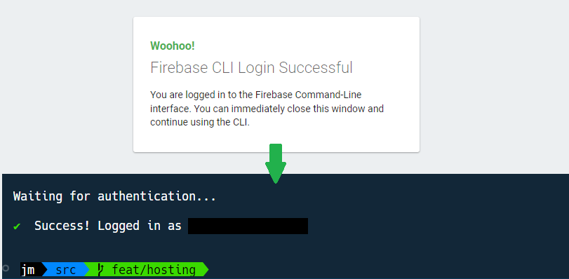

# Configurer son projet pour utiliser Firebase Hosting

À l'issue de ce module, vous serez capable de :

1. Définir les principes de Firebase Hosting
2. Configurer un projet existant pour utiliser Firebase Hosting

---

## Présentation

Dans ce chapitre, nous allons voir découvrir les bases de Firebase Hosting, et nous verrons ensuite comment configurer un projet en vue de l'héberger sur le Web.

Cette configuration ne sera à faire qu'une seule fois par projet.

## Qu'est ce que Firebase Hosting ?

Firebase Hosting est un service de Firebase qui permet d'héberger des sites web **statiques**.

> **Note**
> Firebase Hosting ne permet pas d'héberger des sites web dynamiques (utilisant des technologies comme PHP, MariaDB, PostgreSQL, etc…).
> Il est cependant possible de créer des [_Cloud Functions_](https://firebase.google.com/docs/functions), tournant sur l'environnement Node.js, mais ce n'est pas le sujet de ce cours.

Un site web statique est un site web qui ne contient pas de base de données, et qui ne génère pas de contenu dynamiquement. C'est donc un site web qui contient uniquement des fichiers **HTML, CSS et JavaScript**.

### Avantages

Le service propose plusieurs avantages :

- **Hébergement gratuit** : Firebase Hosting permet d'héberger gratuitement un site web statique, avec un nom de domaine en `.firebaseapp.com` ou `.web.app`.
  (Il est aussi possible d'y associer un nom de domaine personnalisé)

- **Hébergement sécurisé** : Tout le trafic est chiffré avec le protocole HTTPS.

- **Hébergement rapide** : Firebase Hosting utilise un réseau de distribution mondial pour servir les fichiers statiques, et ce de façon automatique.

- **Déploiement facilité** : Firebase Hosting rend la mise en ligne très facile, et permet même d'aller plus loin en automatisant le déploiement, grâce à l'intégration avec GitHub, GitLab ou Bitbucket.


## Installer Firebase CLI

Ouvrez un terminal et lancez la commande suivante :

```bash
npm install -g firebase-tools
```

> **Note**
> Si vous êtes sous macOS ou Linux, vous aurez peut-être besoin de lancer la commande en `sudo`.

## Initialiser Hosting sur le projet « Playground »

Vous allez maintenant initialiser Firebase Hosting sur le projet « Playground » en utilisant le terminal.

Assurez-vous ici de bien vous trouver à l'emplacement du projet « Playground ».

### 1. Se connecter à Firebase

Afin que Firebase CLI reconnaisse votre compte et puisse associer ce projet à votre compte, vous devez vous connecter à Firebase à l'aide la commande suivante :

```bash
firebase login
```

<p align="center">
  
</p>

(Firebase vous pose une première question concernant la collecte de statistiques. Répondez Oui « Y » ou Non « N » selon votre choix.)

Une fenêtre navigateur s'ouvre ensuite et vous invite à vous connecter à votre compte Google.

**Vous devez utiliser le compte Google associé à votre compte Firebase.**

Une fois connecté, vous pouvez fermer la fenêtre navigateur et revenir dans le terminal :

<p align="center">
  
</p>

### 2. Relier le projet « Playground » à Firebase

Afin de lier le projet « Playground » à Firebase et créer la configuration d'hébergement, il faut commencer par initialiser Firebase Hosting :

```bash
firebase init hosting
```

Vont s'en suivre une série de questions pour configurer le projet « Playground ».

> **Warning**
>
> Faites **très attention** pour certaines questions à bien répondre « No » pour ne pas écraser des fichiers existants ou utiliser la mauvaise configuration.
> Par exemple, il ne faut **surtout pas** écraser le fichier `public/index.html` du projet « Playground », **ni configurer une _single-page-app_**.
> Également, à cause de la configuration de notre projet, il ne faut pas utiliser le répertoire `public` comme répertoire de destination mais plutôt la racine : `/`
> Lisez-bien les questions et répondez avec attention.
> Si vous avez un doute, demandez à votre formateur avant de valider la réponse.

Voici un exemple de la configuration dont vous pourriez avoir besoin (les réponses utilisées sont encadrées en vert, et les points d'attention sont indiqués par une icône) :

<p align="center">
  
</p>

Une fois la configuration terminée, vous devriez voir que plusieurs fichiers ont été créés dans votre arborescence du projet « Playground » :

- `./public/404.html` : Une page d'erreur type 404, que vous pouvez complètement personnaliser.
- `.firebaserc` : Un fichier de configuration de Firebase, qui permet de lier le projet « Playground » à votre compte Firebase.
- `firebase.json` : Un fichier de configuration de Firebase Hosting, qui permet de configurer l'hébergement. La configuration présente est celle proposée par défaut.

---

# Pour aller plus loin

- [Get started with Firebase Hosting](https://firebase.google.com/docs/hosting/quickstart?hl=en)

# Vos points clés à retenir

- Pour installer les outils Firebase CLI, il faut lancer la commande `npm install -g firebase-tools`.
- Pour démarrer une nouvelle configuration d'hébergement, il faut lancer la commande `firebase init hosting`.

# Conclusion

Bravo, votre projet est bien configuré pour utiliser Firebase Hosting !

Voyons maintenant l'étape cruciale : déployer le projet « Playground » sur Internet.

À tout de suite dans le prochain chapitre ! 👋