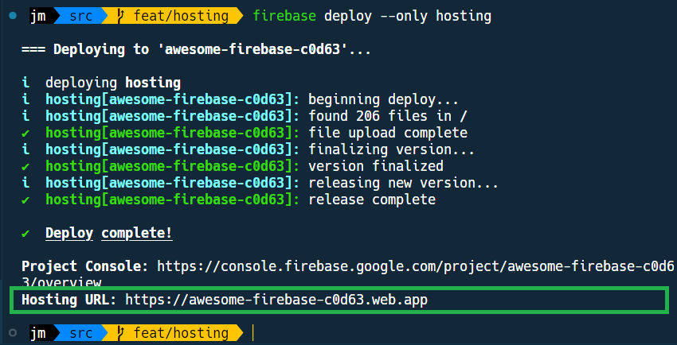

# 02AN - Déployer son projet en ligne

À l'issue de ce module, vous serez capable de :

1. Déployer un projet en ligne avec Firebase Hosting

---

## Présentation

Une fois un projet configuré, il est extrêmement simple de le déployer en ligne.

Voyons comment.

## Déployer son projet en ligne

À nouveau, il faut ouvrir un terminal et se positionner à l'emplacement du projet configuré.

Pour déployer le projet « Playground » en ligne, il suffit de lancer la commande suivante :

```bash
firebase deploy --only hosting
```

Si tout s'est bien passé, vous devriez obtenir votre URL de déploiement se terminant en `.firebaseapp.com` ou `.web.app` :

<p align="center">
  
</p>

Et voilà ! Votre projet est maintenant en ligne à l'adresse indiquée.
N'hésitez pas à aller tester. Tout devrait fonctionner comme sur votre ordinateur.

Notez qu'à chaque modification de votre projet, vous devrez relancer la commande `firebase deploy --only hosting` pour mettre à jour votre site en ligne.

> **Note**
>
> Notre projet ayant été configuré pour être déployé à la racine du site, **vous devrez ajouter `/public` à la fin de l'URL** pour accéder au site.
> Par exemple, si votre URL est `https://awesome-firebase-c0d63.web.app/` alors le site sera visible à l'adresse `https://awesome-firebase-c0d63.web.app/public`.
>
> ---
> Si vous ne souhaitez pas ajouter `/public` à la fin de l'URL, vous pouvez modifier la configuration de votre projet `firebase.json` pour déployer le projet à la racine du site, en remplaçant `"public": "/"` par `"public": "public"`.
> Il faudra aussi modifier tous les fichiers HTML et retirer la balise `<base href="/public/">` dans l'en-tête du site.

---

# Pour aller plus loin

- [Deploy to your Site](https://firebase.google.com/docs/hosting/quickstart?hl=en#deploy)

# Vos points clés à retenir

- La commande permettant de déployer un projet en ligne est `firebase deploy --only hosting`

# Conclusion

Bravo ! Vous connaissez maintenant les bases du déploiement d'un projet en ligne avec Firebase Hosting.

Terminons avec un petit QCM pour vérifier que vous avez bien compris les concepts abordés.