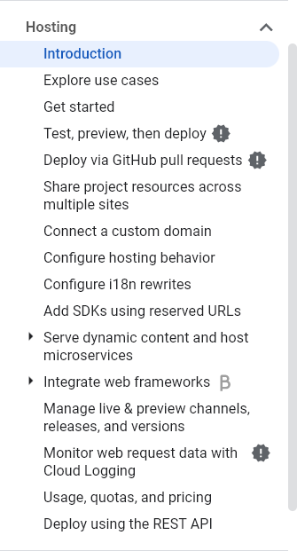

# Note au formateur

> **Warning** : Cette fiche est à disposition du formateur uniquement ! Merci de ne pas partager aux apprenants.

L'objectif ici est de vérifier que l'apprenant a bien réussi la mise en ligne de son projet Firebase Playground sur avec le service **Hosting**

Assurez-vous de vérifier que toutes les pages du projet « Playground » sont bien accessibles en ligne, et fonctionnent correctement.

# Todolist

### Configuration de projet
- [ ] L'apprenant a bien configuré sont projet avec la commande `firebase init`, et les fichiers suivants sont présents :
    ```
    public/
    └── 404.html
    .firebaserc
    firebase.json
    ```
- [ ] La clé `hosting` du fichier `.firebaserc` est bien configurée avec la valeur `/` :
    ```json
    {
      "hosting": {
        "public": "/",
        "ignore": [
          "firebase.json",
          "**/.*",
          "**/node_modules/**"
        ]
      }
    }    
    ```

### Projet « Firebase Playground »
- [ ] L'apprenant a bien déployé son projet « Playground » avec la commande `firebase deploy`.
- [ ] Le projet en ligne est bien accessible et fonctionnel.
- [ ] Les règles de sécurité pour « Realtime Database », « Firestore » et « Storage » sont bien configurées dans la console Web.

---

Ne pas hésiter à encourager l'apprenant à approfondir ses connaissances sur Firebase Hosting, en allant lire l'intégralité de la documentation, qui est très riche en détails et exemples.

Par exemple, on peut aller plus loin sur Hosting en utilisant des _rewrites_ pour rediriger les utilisateurs vers des pages personnalisées en cas d'erreur 404, ou encore en utilisant des _redirects_ pour rediriger les utilisateurs vers une autre URL.

On peut aussi mettre en place une stratégie de déploiement automatisée avec Github.

<p align="center">
  
</p>